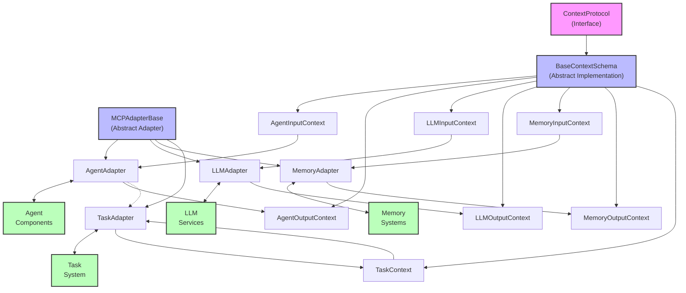

# Model Context Protocol Adapters: Architecture and Implementation Guide

## Architecture Overview

The Model Context Protocol (MCP) adapters form a crucial abstraction layer within the high-performance multi-agent platform. This component serves as a bridge between various modules of the system, ensuring they can communicate through a standardized interface while remaining decoupled from each other's implementation details.

### Core Concepts

The MCP adapter system is built around the following key concepts:

1. **Context Protocol**: A standardized format for passing data between components without tight coupling.
2. **Adapter Pattern**: A structural design pattern that allows objects with incompatible interfaces to collaborate.
3. **Serialization/Deserialization**: Converting between domain-specific objects and standardized context formats.
4. **Lazy Loading**: A technique to prevent circular dependencies by loading components only when needed.

### Component Interactions



The adapters provide bidirectional translation between:
- **System Components**: Agents, LLMs, Memory, Task, Workflow, and Orchestration
- **MCP Context**: Standardized protocol for communication

The system follows the principles of:

1. **Interface Segregation**: Components interact only through well-defined interfaces.
2. **Dependency Inversion**: High-level modules don't depend on low-level modules.
3. **Separation of Concerns**: Each adapter focuses solely on translation between contexts.

### Design Patterns Used

The MCP adapters implement several design patterns that enhance the system's maintainability, extensibility, and performance:

1. **Adapter Pattern**: The core pattern enabling communication between incompatible interfaces.
2. **Factory Method**: For creating adapters based on component types.
3. **Command Pattern**: Used in the refactored Memory adapter to handle different operations.
4. **Strategy Pattern**: Allows selection of different adaptation strategies based on context type.
5. **Chain of Responsibility**: For processing context through multiple adapters.
6. **Decorator Pattern**: For enhancing context objects with additional capabilities.

### Key Abstractions

The following abstractions form the foundation of the MCP adapter system:

1. **ContextProtocol**: The base interface all context objects must implement.
2. **BaseContextSchema**: A common implementation of the ContextProtocol.
3. **MCPAdapterBase**: The abstract base class for all adapters.
4. **InputContext/OutputContext**: Specialized context classes for each component type.

## Component Details

### Core/MCP Base Components

#### MCPAdapterBase

The foundational abstract class for all adapters, providing a common interface for converting between contexts and component-specific formats.

```python
class MCPAdapterBase(abc.ABC):
    def __init__(self, target_component: Any, mcp_context_type: Optional[Type[ContextProtocol]]=None):
        self.target_component = target_component
        self.mcp_context_type = mcp_context_type
        
    @abc.abstractmethod
    async def adapt_input(self, context: ContextProtocol, **kwargs: Any) -> Any:
        pass

    @abc.abstractmethod
    async def adapt_output(self, component_output: Any, original_context: Optional[ContextProtocol]=None, **kwargs: Any) -> ContextProtocol:
        pass

    async def process_with_mcp(self, context: ContextProtocol, **kwargs: Any) -> ContextProtocol:
        # Default implementation that handles the full process flow
```

**Key Features:**
- Abstract methods ensuring consistent interface
- Default `process_with_mcp` implementation handling the complete processing flow
- Support for asynchronous operations throughout
- Error handling with proper context preservation

#### ContextProtocol

The interface contract that all context objects must fulfill:

```python
class ContextProtocol(abc.ABC, BaseModel):
    version: str = '1.0.0'
    
    @abc.abstractmethod
    def serialize(self) -> Dict[str, Any]:
        pass

    @classmethod
    @abc.abstractmethod
    def deserialize(cls, data: Dict[str, Any]) -> 'ContextProtocol':
        pass

    @abc.abstractmethod
    def optimize(self) -> 'ContextProtocol':
        pass
```

**Key Features:**
- Standardized serialization/deserialization
- Context optimization for efficient token usage
- Version tracking for backward compatibility

### AgentAdapter

The AgentAdapter translates between agent-specific formats and the standardized MCP context.

#### Primary Classes

1. **AgentInputContext**: Represents input to an agent.
   ```python
   class AgentInputContext(BaseContextSchema):
       agent_type: str
       task_context: Optional[TaskContext] = None
       parameters: Dict[str, Any] = {}
       prompt: Optional[str] = None
   ```

2. **AgentOutputContext**: Represents output from an agent.
   ```python
   class AgentOutputContext(BaseContextSchema):
       success: bool
       output_data: Optional[Dict[str, Any]] = None
       error_message: Optional[str] = None
       agent_name: Optional[str] = None
   ```

3. **AgentAdapter**: Handles conversion between agent contexts and core components.

#### Responsibilities

1. Converting MCP context to agent-compatible format
2. Converting agent results back to MCP context
3. Managing task context conversions within agent contexts
4. Handling proper error propagation

#### Example Usage

```python
# Create the adapter
agent_adapter = AgentAdapter(target_component=my_agent)

# Create input context
input_context = AgentInputContext(
    context_id=str(uuid.uuid4()),
    agent_type="reasoning_agent",
    parameters={"max_tokens": 1000},
    metadata={"trace_id": "trace-123"}
)

# Process through the adapter
output_context = await agent_adapter.process_with_mcp(input_context)

# Use the output
if output_context.success:
    result_data = output_context.output_data
else:
    error_message = output_context.error_message
```

#### Best Practices

- **Initializing Task Contexts**: Ensure task contexts are properly initialized and complete
- **Metadata Propagation**: Preserve metadata across context conversions
- **Error Handling**: Include error details in output contexts for better debugging
- **Task Adapter Management**: Use the `_get_task_adapter()` method to avoid circular imports

### LLMAdapter

The LLMAdapter bridges between language model services and the rest of the system.

#### Primary Classes

1. **LLMInputContext**: Represents input to a language model.
   ```python
   class LLMInputContext(BaseContextSchema):
       model: str
       prompt: Optional[str] = None
       messages: Optional[List[Dict[str, str]]] = None
       parameters: Dict[str, Any] = Field(default_factory=dict)
       use_cache: bool = True
       retry_on_failure: bool = True
   ```

2. **LLMOutputContext**: Represents output from a language model.
   ```python
   class LLMOutputContext(BaseContextSchema):
       success: bool
       result_text: Optional[str] = None
       choices: Optional[List[Dict[str, Any]]] = None
       usage: Optional[Dict[str, int]] = None
       error_message: Optional[str] = None
       model_used: Optional[str] = None
   ```

3. **LLMAdapter**: Handles context adaptation for language models.

#### Key Methods

The refactored LLMAdapter contains these key helper methods:

```python
def _track_llm_metrics(self, model, result_data, duration, context_labels, should_track_metrics=True)
def _track_llm_error(self, model, error_code, context_labels, should_track_metrics=True)
async def _select_models(self, requested_model)
async def _execute_llm_request(self, primary_model, fallback_models, call_args)
```

#### Example Usage

```python
# Create the adapter
llm_adapter = LLMAdapter()

# Create input context
input_context = LLMInputContext(
    context_id=str(uuid.uuid4()),
    model="gpt-4",
    prompt="Explain quantum computing",
    parameters={
        "temperature": 0.7,
        "max_tokens": 1000
    }
)

# Process through the adapter
output_context = await llm_adapter.process_with_mcp(input_context)

# Use the output
if output_context.success:
    result_text = output_context.result_text
    token_usage = output_context.usage
    model_used = output_context.model_used
else:
    error_message = output_context.error_message
```

#### Performance Considerations

- **Token Usage Optimization**: The LLMAdapter tracks token usage and optimizes prompts
- **Model Fallback**: Handles model failures with appropriate fallbacks
- **Caching**: Supports result caching through parameters
- **Metrics Tracking**: Efficient tracking of performance metrics

### MemoryAdapter

The MemoryAdapter bridges between memory storage systems and MCP contexts.

#### Primary Classes

1. **MemoryInputContext**: Represents input to memory operations.
   ```python
   class MemoryInputContext(BaseContextSchema):
       operation: str
       key: Optional[str] = None
       context_id: str
       data: Optional[Any] = None
       ttl: Optional[int] = None
       query: Optional[str] = None
       k: Optional[int] = None
       filter_metadata: Optional[Dict[str, Any]] = None
   ```

2. **MemoryOutputContext**: Represents output from memory operations.
   ```python
   class MemoryOutputContext(BaseContextSchema):
       success: bool
       result: Optional[Any] = None
       error_message: Optional[str] = None
   ```

3. **MemoryAdapter**: Manages conversion between memory operations and contexts.

#### Operation Handlers

The refactored implementation uses operation handlers instead of if-else chains:

```python
self._operation_handlers = {
    'load': self._adapt_load_operation,
    'save': self._adapt_save_operation,
    'delete': self._adapt_delete_operation,
    'clear': self._adapt_clear_operation,
    'search_vectors': self._adapt_search_vectors_operation,
    'store_vector': self._adapt_store_vector_operation,
    'exists': self._adapt_exists_operation,
    'list_keys': self._adapt_list_keys_operation,
}
```

#### Example Usage

```python
# Create the adapter
memory_adapter = MemoryAdapter(target_component=memory_manager)

# Create input context for loading data
load_context = MemoryInputContext(
    context_id="session-123",
    operation="load",
    key="conversation_history",
    metadata={"use_cache": True}
)

# Process through the adapter
output_context = await memory_adapter.process_with_mcp(load_context)

# Use the output
if output_context.success:
    conversation_history = output_context.result
else:
    error_message = output_context.error_message
```

#### Best Practices

- **Operation Selection**: Use the appropriate operation type for each memory interaction
- **Context IDs**: Ensure consistent context IDs for related operations
- **TTL Management**: Explicitly set TTL values for time-sensitive data
- **Vector Operations**: Use proper metadata for vector storage and retrieval

## Usage Examples

### Combining Multiple Adapters

The adapters can be chained together to enable complex workflows:

```python
async def process_agent_with_memory(question: str, context_id: str):
    # Set up adapters
    memory_adapter = MemoryAdapter(memory_manager)
    llm_adapter = LLMAdapter()
    agent_adapter = AgentAdapter(reasoning_agent)
    
    # Load context from memory
    memory_input = MemoryInputContext(
        context_id=context_id,
        operation="load",
        key="conversation"
    )
    memory_output = await memory_adapter.process_with_mcp(memory_input)
    
    # Create LLM context with conversation history
    llm_input = LLMInputContext(
        context_id=context_id,
        model="gpt-4",
        prompt=f"Question: {question}\nContext: {memory_output.result}",
        parameters={"temperature": 0.7}
    )
    llm_output = await llm_adapter.process_with_mcp(llm_input)
    
    # Create agent context with LLM output
    agent_input = AgentInputContext(
        context_id=context_id,
        agent_type="reasoning",
        parameters={"llm_analysis": llm_output.result_text}
    )
    agent_output = await agent_adapter.process_with_mcp(agent_input)
    
    # Save results to memory
    save_input = MemoryInputContext(
        context_id=context_id,
        operation="save",
        key="agent_result",
        data=agent_output.output_data
    )
    await memory_adapter.process_with_mcp(save_input)
    
    return agent_output.output_data
```

### Error Handling

```python
async def safe_llm_processing(prompt: str, model: str, fallback_model: str = None):
    llm_adapter = LLMAdapter()
    
    try:
        # Create primary context
        input_context = LLMInputContext(
            context_id=str(uuid.uuid4()),
            model=model,
            prompt=prompt
        )
        
        if fallback_model:
            input_context.metadata["fallback_models"] = [fallback_model]
        
        # Attempt processing
        output_context = await llm_adapter.process_with_mcp(input_context)
        
        if not output_context.success:
            logger.warning(f"LLM processing failed: {output_context.error_message}")
            
        return output_context
        
    except Exception as e:
        logger.error(f"Unexpected error in LLM processing: {e}")
        
        # Create error output context
        return LLMOutputContext(
            context_id=input_context.context_id if 'input_context' in locals() else str(uuid.uuid4()),
            success=False,
            error_message=f"Processing error: {str(e)}"
        )
```

### Memory Operations with Vector Search

```python
async def semantic_memory_search(query: str, context_id: str, k: int = 5):
    memory_adapter = MemoryAdapter(memory_manager)
    
    # Create vector search context
    search_context = MemoryInputContext(
        context_id=context_id,
        operation="search_vectors",
        query=query,
        k=k,
        filter_metadata={"source": "conversation"}
    )
    
    # Perform search
    search_output = await memory_adapter.process_with_mcp(search_context)
    
    if not search_output.success:
        logger.error(f"Vector search failed: {search_output.error_message}")
        return []
    
    # Process results
    results = search_output.result
    
    # Load details for each result
    detailed_results = []
    for result in results:
        if "id" in result:
            load_context = MemoryInputContext(
                context_id=context_id,
                operation="load",
                key=f"memory:{result['id']}"
            )
            load_output = await memory_adapter.process_with_mcp(load_context)
            
            if load_output.success and load_output.result:
                detailed_results.append({
                    "text": result.get("text", ""),
                    "score": result.get("score", 0),
                    "details": load_output.result
                })
    
    return detailed_results
```

## Best Practices

### Context Management

1. **Context Propagation**: Always propagate context IDs through related operations
   ```python
   # Good
   output_context = await adapter.adapt_output(result, input_context)
   
   # Bad - loses original context ID
   output_context = await adapter.adapt_output(result)
   ```

2. **Metadata Handling**: Use metadata for cross-cutting concerns
   ```python
   # Add trace information
   input_context.metadata["trace_id"] = trace_id
   input_context.metadata["parent_id"] = parent_id
   
   # Set operation-specific flags
   input_context.metadata["use_cache"] = True
   input_context.metadata["track_metrics"] = True
   ```

3. **Explicit Context Types**: Always use the most specific context type
   ```python
   # Good - specific context
   agent_context = AgentInputContext(agent_type="reasoning", ...)
   
   # Bad - generic context
   agent_context = BaseContextSchema(metadata={"agent_type": "reasoning"}, ...)
   ```

### Error Handling

1. **Complete Error Information**: Include detailed error information
   ```python
   # Good
   output_context = MemoryOutputContext(
       success=False,
       error_message=str(e),
       metadata={"error_type": type(e).__name__, "operation": operation_name}
   )
   
   # Bad - minimal information
   output_context = MemoryOutputContext(success=False)
   ```

2. **Error Propagation**: Preserve original errors when possible
   ```python
   # Good
   try:
       result = await component.execute(adapted_input)
   except Exception as e:
       raise ComponentError(f"Execution failed: {e}", original_error=e)
       
   # Bad - loses original error
   try:
       result = await component.execute(adapted_input)
   except Exception:
       raise ComponentError("Execution failed")
   ```

3. **Contextual Logging**: Include context information in logs
   ```python
   # Good
   logger.error(f"Error processing context {context.context_id}: {e}", 
               extra={"context_id": context.context_id, "operation": operation_name})
               
   # Bad - minimal context
   logger.error(f"Processing error: {e}")
   ```

### Performance Optimization

1. **Lazy Loading**: Use lazy loading for dependencies
   ```python
   # Good - load only when needed
   def _get_dependency(self):
       if self._dependency is None:
           from module.path import Dependency
           self._dependency = Dependency()
       return self._dependency
       
   # Bad - always load at import
   from module.path import Dependency
   ```

2. **Context Optimization**: Use context optimization for token reduction
   ```python
   # Good
   optimized_context = context.optimize()
   
   # Bad - use raw context for all operations
   raw_context = context
   ```

3. **Metrics Tracking Efficiency**: Batch metrics or use sampling
   ```python
   # Good - conditional tracking
   if should_track_metrics and operation_is_significant:
       self._track_metrics(...)
       
   # Bad - track everything
   self._track_metrics(...)
   ```

## Testing Approach

The testing strategy for MCP adapters focuses on comprehensive validation of both individual adapters and their integration.

### Test Structure

The test suite is organized into these main components:

1. **Base Test Classes**: Common fixtures and utilities
2. **Adapter-Specific Tests**: Tests for each adapter type
3. **Performance Tests**: Validation of adapter overhead
4. **Integration Tests**: End-to-end flows with multiple adapters

### Test Fixtures

Key fixtures include:

1. **mock_env_vars**: Sets environment variables for testing
2. **mock_context/mock_task_context**: Base context objects for testing
3. **Adapter-specific contexts**: Input/output contexts for each adapter type
4. **Mock components**: Mocked versions of system components

### Test Categories

1. **Adaptation Tests**: Verify correct conversion between contexts and component formats
2. **Error Handling Tests**: Validate proper error propagation and handling
3. **Integration Tests**: Test complete process flows
4. **Performance Tests**: Ensure overhead is within acceptable limits

### Running Tests

```bash
# Run all tests
pytest tests/core/mcp/test_adapters.py

# Run tests for a specific adapter
pytest tests/core/mcp/test_adapters.py::TestAgentAdapter

# Run performance tests
pytest tests/core/mcp/test_adapters.py::TestAdapterPerformance

# Run with coverage
pytest tests/core/mcp/test_adapters.py --cov=src/core/mcp/adapters
```

### Test Patterns

1. **Concrete Class Testing**: For abstract adapters, test concrete implementations
   ```python
   class ConcreteAgentAdapter(AgentAdapter):
       # Implement abstract methods for testing
   ```

2. **Mock Component Patching**: Use patching to inject dependencies
   ```python
   with patch("src.llm.get_adapter", return_value=mock_llm_provider):
       # Test with mocked dependency
   ```

3. **Performance Validation**: Use timing assertions
   ```python
   start_time = asyncio.get_event_loop().time()
   await adapter.adapt_input(context)
   end_time = asyncio.get_event_loop().time()
   assert (end_time - start_time) < 0.001
   ```

## Implementation Notes

### Critical Design Decisions

1. **Operation Handler Pattern**: Replacing if-else chains with handler mapping
   ```python
   # Before refactoring
   if operation == "load":
       # Handle load
   elif operation == "save":
       # Handle save
   # ...
   
   # After refactoring
   self._operation_handlers = {
       "load": self._adapt_load_operation,
       "save": self._adapt_save_operation,
       # ...
   }
   handler = self._operation_handlers.get(operation)
   return await handler(context)
   ```

2. **Lazy Loading for Circular Dependencies**: Using on-demand imports
   ```python
   # Before refactoring
   from src.core.mcp.adapters.task_adapter import TaskAdapter
   
   # After refactoring
   def _get_task_adapter(self):
       if self._task_adapter is None:
           from src.core.mcp.adapters.task_adapter import TaskAdapter
           self._task_adapter = TaskAdapter()
       return self._task_adapter
   ```

3. **Helper Methods for Metric Tracking**: Extracted from complex methods
   ```python
   # Before refactoring
   metrics.track_llm("requests", model=model, provider=provider, **context_labels)
   metrics.track_llm("duration", value=duration, model=model, provider=provider, **context_labels)
   # Many more tracking calls...
   
   # After refactoring
   self._track_llm_metrics(model, result_data, duration, context_labels)
   ```

### Thread Safety Considerations

1. **Immutable Contexts**: Context objects are immutable to prevent race conditions
2. **Stateless Adapters**: Adapters maintain minimal state
3. **Asynchronous Design**: All adapter methods are asynchronous

### Asynchronous Patterns

1. **Consistent Async Interfaces**: All public methods are asynchronous
2. **Proper Await Usage**: Consistent awaiting of async dependencies
3. **Error Propagation**: Maintaining context in asynchronous error handling

## API Reference

### MCPAdapterBase

```python
class MCPAdapterBase(abc.ABC):
    def __init__(self, target_component: Any, mcp_context_type: Optional[Type[ContextProtocol]]=None):
        """
        Initialize the adapter.
        
        Args:
            target_component: The component this adapter wraps
            mcp_context_type: The context type this adapter works with
        """
    
    @abc.abstractmethod
    async def adapt_input(self, context: ContextProtocol, **kwargs: Any) -> Any:
        """
        Convert MCP context to component-specific input.
        
        Args:
            context: The MCP context to adapt
            kwargs: Additional parameters for adaptation
            
        Returns:
            Component-specific input format
            
        Raises:
            ValueError: If context type is incompatible
            SerializationError: If adaptation fails
        """
    
    @abc.abstractmethod
    async def adapt_output(self, component_output: Any, original_context: Optional[ContextProtocol]=None, **kwargs: Any) -> ContextProtocol:
        """
        Convert component output to MCP context.
        
        Args:
            component_output: The output from the component
            original_context: The original input context
            kwargs: Additional parameters for adaptation
            
        Returns:
            MCP context containing the adapted output
            
        Raises:
            ValueError: If output type is incompatible
            SerializationError: If adaptation fails
        """
    
    async def process_with_mcp(self, context: ContextProtocol, **kwargs: Any) -> ContextProtocol:
        """
        Process a context through the complete adapter flow.
        
        Args:
            context: The input MCP context
            kwargs: Additional parameters for processing
            
        Returns:
            Output MCP context
            
        Raises:
            Various exceptions depending on component behavior
        """
```

### AgentAdapter

```python
class AgentAdapter(MCPAdapterBase):
    def __init__(self, target_component: Optional[Type[BaseAgent]]=None, task_adapter=None):
        """
        Initialize the agent adapter.
        
        Args:
            target_component: The agent component or class
            task_adapter: Optional TaskAdapter instance to avoid circular imports
        """
    
    def _get_task_adapter(self):
        """
        Get or create a TaskAdapter instance.
        
        Returns:
            TaskAdapter instance
        """
    
    async def adapt_input(self, context: ContextProtocol, **kwargs: Any) -> CoreAgentContext:
        """
        Convert MCP context to agent context.
        
        Args:
            context: AgentInputContext or compatible context
            kwargs: Additional parameters
            
        Returns:
            CoreAgentContext for agent execution
            
        Raises:
            ValueError: If context type is incompatible
            SerializationError: If adaptation fails
        """
    
    async def adapt_output(self, component_output: Any, original_context: Optional[ContextProtocol]=None, **kwargs: Any) -> AgentOutputContext:
        """
        Convert agent result to MCP context.
        
        Args:
            component_output: AgentResult or Exception
            original_context: Original input context
            kwargs: Additional parameters
            
        Returns:
            AgentOutputContext with result or error
            
        Raises:
            ValueError: If output type is incompatible
            SerializationError: If adaptation fails
        """
```

### LLMAdapter

```python
class LLMAdapter(MCPAdapterBase):
    def __init__(self, target_component: Optional[BaseLLMAdapter]=None):
        """
        Initialize the LLM adapter.
        
        Args:
            target_component: Optional pre-configured LLM adapter
        """
    
    async def _get_target_llm_adapter(self, model_name: str) -> BaseLLMAdapter:
        """
        Get or create an LLM adapter for the specified model.
        
        Args:
            model_name: Name of the LLM model
            
        Returns:
            BaseLLMAdapter instance
            
        Raises:
            LLMError: If adapter creation fails
        """
    
    def _track_llm_metrics(self, model: str, result_data: Dict[str, Any], 
                         duration: float, context_labels: Dict[str, str],
                         should_track_metrics: bool = True) -> None:
        """
        Track metrics for successful LLM request.
        
        Args:
            model: Model name
            result_data: LLM response data
            duration: Request duration
            context_labels: Context labels for metrics
            should_track_metrics: Whether to track metrics
        """
    
    def _track_llm_error(self, model: str, error_code: Union[ErrorCode, str], 
                       context_labels: Dict[str, str],
                       should_track_metrics: bool = True) -> None:
        """
        Track metrics for failed LLM request.
        
        Args:
            model: Model name
            error_code: Error code or type
            context_labels: Context labels for metrics
            should_track_metrics: Whether to track metrics
        """
    
    async def _select_models(self, requested_model: str) -> Tuple[str, List[str]]:
        """
        Select primary and fallback models.
        
        Args:
            requested_model: Requested model name
            
        Returns:
            Tuple of (primary_model, fallback_models)
        """
    
    async def _execute_llm_request(
        self, 
        primary_model: str, 
        fallback_models: List[str],
        call_args: Dict[str, Any]
    ) -> Tuple[str, Dict[str, Any]]:
        """
        Execute LLM request with fallbacks.
        
        Args:
            primary_model: Primary model to use
            fallback_models: Fallback models
            call_args: Arguments for the request
            
        Returns:
            Tuple of (model_used, result_data)
            
        Raises:
            LLMError: If all model attempts fail
        """
    
    async def adapt_input(self, context: ContextProtocol, **kwargs: Any) -> Dict[str, Any]:
        """
        Convert LLM context to request arguments.
        
        Args:
            context: LLMInputContext
            kwargs: Additional parameters
            
        Returns:
            Dictionary of LLM request arguments
            
        Raises:
            ValueError: If context type is incompatible
            SerializationError: If adaptation fails
        """
    
    async def adapt_output(self, component_output: Any, original_context: Optional[ContextProtocol]=None, **kwargs: Any) -> LLMOutputContext:
        """
        Convert LLM response to output context.
        
        Args:
            component_output: LLM response or error
            original_context: Original input context
            kwargs: Additional parameters
            
        Returns:
            LLMOutputContext with result or error
            
        Raises:
            SerializationError: If adaptation fails
        """
    
    async def process_with_mcp(self, context: ContextProtocol, **kwargs: Any) -> ContextProtocol:
        """
        Process a context through the LLM adapter.
        
        Args:
            context: LLMInputContext
            kwargs: Additional parameters
            
        Returns:
            LLMOutputContext with result or error
        """
```

### MemoryAdapter

```python
class MemoryAdapter(MCPAdapterBase):
    def __init__(self, target_component: Union[BaseMemory, MemoryManager]):
        """
        Initialize the memory adapter.
        
        Args:
            target_component: Memory storage implementation
            
        Raises:
            TypeError: If target_component is not a valid memory component
        """
    
    async def _adapt_load_operation(self, context: MemoryInputContext) -> Tuple[Dict[str, Any], str]:
        """
        Adapt input for load operation.
        
        Args:
            context: Memory input context
            
        Returns:
            Tuple of (args_dict, method_name)
            
        Raises:
            ValueError: If required parameters are missing
        """
        
    # Similar methods for other operations
    
    async def adapt_input(self, context: ContextProtocol, **kwargs: Any) -> Dict[str, Any]:
        """
        Convert memory context to operation arguments.
        
        Args:
            context: MemoryInputContext
            kwargs: Additional parameters
            
        Returns:
            Dictionary with operation and arguments
            
        Raises:
            ValueError: If context type is incompatible
            ValueError: If operation is unsupported
            SerializationError: If adaptation fails
        """
    
    async def adapt_output(self, component_output: Any, original_context: Optional[ContextProtocol]=None, **kwargs: Any) -> MemoryOutputContext:
        """
        Convert memory operation result to output context.
        
        Args:
            component_output: Operation result or error
            original_context: Original input context
            kwargs: Additional parameters including operation name
            
        Returns:
            MemoryOutputContext with result or error
            
        Raises:
            SerializationError: If adaptation fails
        """
    
    async def process_with_mcp(self, context: ContextProtocol, **kwargs: Any) -> ContextProtocol:
        """
        Process a context through the memory adapter.
        
        Args:
            context: MemoryInputContext
            kwargs: Additional parameters
            
        Returns:
            MemoryOutputContext with result or error
        """
```

## Integration Guidelines

### Basic Integration Steps

1. **Import Adapters**:
   ```python
   from src.core.mcp.adapters.agent_adapter import AgentAdapter
   from src.core.mcp.adapters.llm_adapter import LLMAdapter
   from src.core.mcp.adapters.memory_adapter import MemoryAdapter
   ```

2. **Create Component Instances**:
   ```python
   agent = get_agent("reasoning_agent")
   memory_manager = get_memory_manager()
   ```

3. **Initialize Adapters**:
   ```python
   agent_adapter = AgentAdapter(agent)
   memory_adapter = MemoryAdapter(memory_manager)
   llm_adapter = LLMAdapter()  # Will create adapters on demand
   ```

4. **Create Input Contexts**:
   ```python
   from src.core.mcp.adapters.memory_adapter import MemoryInputContext
   
   context = MemoryInputContext(
       context_id="session-123",
       operation="load",
       key="state"
   )
   ```

5. **Process Through Adapters**:
   ```python
   output_context = await memory_adapter.process_with_mcp(context)
   ```

### Configuration Options

Adapters can be configured through:

1. **Constructor Parameters**:
   ```python
   # Pre-configured LLM adapter
   llm_adapter = LLMAdapter(target_component=existing_llm_adapter)
   
   # Task adapter injection
   agent_adapter = AgentAdapter(agent, task_adapter=existing_task_adapter)
   ```

2. **Context Metadata**:
   ```python
   # Configure caching behavior
   memory_context.metadata["use_cache"] = True
   
   # Configure metrics tracking
   llm_context.metadata["track_metrics"] = True
   
   # Set fallback models
   llm_context.metadata["fallback_models"] = ["gpt-3.5-turbo"]
   ```

### Integration with Custom Components

To integrate a custom component:

1. **Create a Custom Adapter**:
   ```python
   from src.core.mcp.adapter_base import MCPAdapterBase
   
   class CustomComponentAdapter(MCPAdapterBase):
       async def adapt_input(self, context, **kwargs):
           # Implementation
           
       async def adapt_output(self, component_output, original_context=None, **kwargs):
           # Implementation
   ```

2. **Define Context Schemas**:
   ```python
   from src.core.mcp.schema import BaseContextSchema
   
   class CustomInputContext(BaseContextSchema):
       # Custom fields
       
   class CustomOutputContext(BaseContextSchema):
       # Custom fields
   ```

3. **Register Your Adapter** (optional):
   ```python
   from src.core.registry import register_adapter
   
   register_adapter("custom_component", CustomComponentAdapter)
   ```

## Key Improvements

The refactoring of the MCP adapters introduced several substantial improvements to the codebase:

### 1. Circular Dependency Resolution

**Before Refactoring:**
- Circular imports between agent_adapter.py and task_adapter.py
- Import statements at the bottom of files
- Potential for import errors or unpredictable behavior

**After Refactoring:**
- Implemented lazy loading pattern with `_get_task_adapter()`
- Dependency injection through constructor parameters
- All imports consolidated at the top of files

**Benefits:**
- Eliminated circular import issues
- Improved module loading performance
- Better testability through dependency injection
- More predictable initialization behavior

### 2. Operation Handler Pattern

**Before Refactoring:**
- Large if-elif chains in memory_adapter.py
- Difficult to add new operations
- Code duplication for similar operations
- Poor maintainability

**After Refactoring:**
- Implemented operation handler mapping
- Extracted operation-specific logic to dedicated methods
- Consistent operation handling pattern

**Benefits:**
- Improved code organization
- Easier to extend with new operations
- Better modularity and maintainability
- More consistent error handling
- Reduced cyclomatic complexity

### 3. Helper Methods for Metric Tracking

**Before Refactoring:**
- Duplicated metric tracking code in multiple places
- Inconsistent tracking patterns
- Large, complex methods with multiple responsibilities

**After Refactoring:**
- Extracted dedicated helper methods for metric tracking
- Consistent tracking approach
- Centralized configuration of tracking behavior

**Benefits:**
- Reduced code duplication
- More consistent metrics collection
- Better performance through conditional tracking
- Improved readability of main processing methods
- Easier to modify tracking behavior

### 4. Improved Test Structure

**Before Refactoring:**
- Limited test coverage
- Complex test setup
- Test failures due to implementation issues

**After Refactoring:**
- Comprehensive test structure
- Proper mocking of dependencies
- Performance validation
- Test coverage for error scenarios

**Benefits:**
- More reliable testing
- Better test maintainability
- Validation of performance requirements
- Earlier detection of regressions

These improvements have resulted in a more maintainable, extensible, and reliable MCP adapter system that serves as a robust foundation for the multi-agent platform communication infrastructure.