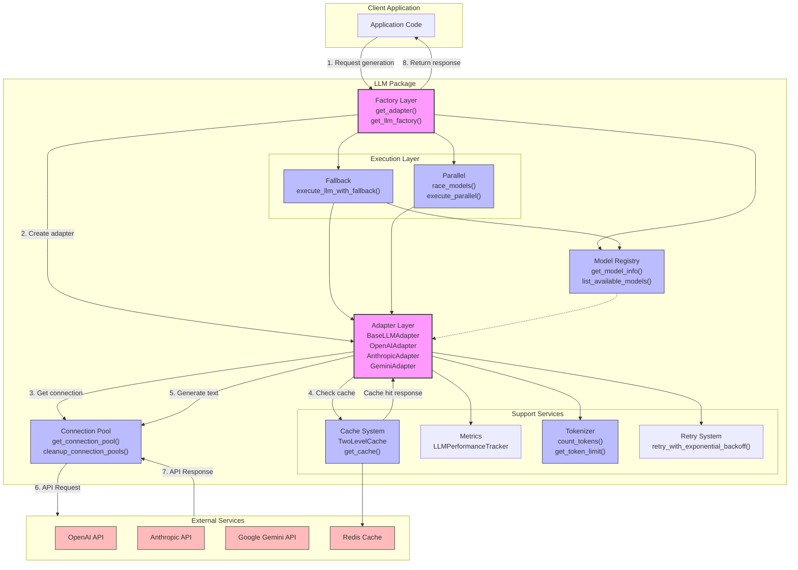

# LLM Package Documentation

## Architecture Overview

The LLM package implements a flexible abstraction layer for interacting with multiple large language model providers, ensuring consistent interfaces, efficient resource management, and resilient operation. The system follows a modular architecture with several key design patterns:

- **Adapter Pattern**: Provides a unified interface to different LLM providers (OpenAI, Anthropic, Gemini)
- **Factory Pattern**: Creates appropriate adapter instances based on model names
- **Strategy Pattern**: Dynamically selects models and fallback approaches
- **Singleton Pattern**: Manages shared resources like connection pools and caches
- **Decorator Pattern**: Adds behaviors like retries, metrics, and performance tracking

The architecture employs several key abstractions:

1. **BaseLLMAdapter**: The core abstraction providing a unified interface to different LLM providers
2. **Connection Pool**: Manages HTTP connections efficiently across requests
3. **Two-Level Cache**: Optimizes performance with local and Redis-based caching
4. **Model Context Protocol (MCP)**: Standardizes context handling across components



## Component Details

### 1. Base Adapter System

#### Purpose and Responsibilities
The base adapter system provides a unified interface for working with different LLM providers through the `BaseLLMAdapter` abstract class.

#### Core Classes
- `BaseLLMAdapter`: Abstract base class defining the common interface
- `OpenAIAdapter`, `AnthropicAdapter`, `GeminiAdapter`: Provider-specific implementations
- `get_adapter()`: Factory function to create appropriate adapters based on model name

#### Key Features
- Unified interface for text generation
- Consistent error handling and reporting
- Performance tracking and metrics
- Token counting and management
- Request/response processing
- Automatic retries with backoff

#### Usage Example

```python
from src.llm import get_adapter

# Create an adapter for OpenAI
adapter = get_adapter("gpt-4o", temperature=0.7)

# Generate text
response = await adapter.generate(
    prompt="Explain quantum computing in simple terms.",
    max_tokens=300
)

# Extract the response text
text = response["choices"][0]["text"]
```

#### Best Practices
- Initialize adapters at application startup
- Reuse adapter instances when possible
- Configure appropriate timeouts based on expected model latency
- Implement proper error handling around API calls
- Close adapters when finished to release resources

### 2. Connection Pool Management

#### Purpose and Responsibilities
Efficiently manages HTTP connections to LLM provider APIs, reducing connection overhead and improving performance.

#### Core Classes
- `get_connection_pool()`: Creates or retrieves a connection pool for a provider
- `cleanup_connection_pools()`: Properly closes all connection pools
- `health_check()`: Verifies connection pool health

#### Key Features
- Provider-specific connection configuration
- Automatic connection reuse
- Connection lifecycle management
- Connection health monitoring
- Configurable pool sizes and timeouts

#### Usage Example

```python
from src.llm.connection_pool import get_connection_pool, cleanup_connection_pools

# Get a connection pool for a specific provider
session = await get_connection_pool("openai")

# Use the session for custom requests
async with session.post(url, json=payload, headers=headers) as response:
    result = await response.json()
    
# Clean up when application is shutting down
await cleanup_connection_pools()
```

#### Best Practices
- Obtain connection pools via the `get_connection_pool()` function
- Let the connection pool manage connection lifecycle
- Always clean up pools during application shutdown
- Configure appropriate pool sizes based on expected concurrent requests

### 3. Caching System

#### Purpose and Responsibilities
Improves performance and reduces API costs by caching LLM responses with a two-level caching strategy.

#### Core Classes
- `LLMCache`: Abstract interface for caching
- `TwoLevelCache`: Implementation with memory (L1) and Redis (L2) layers
- `get_cache()`: Retrieves the singleton cache instance
- `cache_result()`: Helper for caching results

#### Key Features
- Two-level caching (memory + Redis)
- TTL-based expiration
- Efficient cache key generation
- Cache statistics and monitoring
- Thread-safe operation

#### Usage Example

```python
from src.llm.cache import get_cache, cache_result

# Get the cache instance
cache = await get_cache()

# Manually check for cached data
cache_key = "my_cache_key"
cached_result = await cache.get(cache_key)

if cached_result is None:
    # Generate new data
    result = await expensive_operation()
    # Cache the result (with 1-hour TTL)
    await cache_result(cache_key, result, ttl=3600)
else:
    result = cached_result

# Clear the cache if needed
await cache.clear()
```

#### Best Practices
- Use deterministic cache keys for consistent results
- Set appropriate TTLs based on data freshness requirements
- Monitor cache hit rates to tune cache size
- Create cache keys that encapsulate all relevant parameters
- Use stable serialization for cache key generation

### 4. Model Selection and Fallback

#### Purpose and Responsibilities
Intelligently selects models and implements fallback strategies when models fail.

#### Core Classes
- `select_models()`: Selects primary and fallback models
- `execute_llm_with_fallback()`: Executes requests with automatic fallback
- `race_models()`: Runs multiple models in parallel and returns the fastest result
- `execute_with_fallbacks()`: Sequential fallback execution with detailed control

#### Key Features
- Automatic model selection based on task requirements
- Configurable fallback sequences
- Intelligent error handling for retry vs. fallback decisions
- Parallel execution with cancellation
- Detailed metrics on fallback operations

#### Usage Example

```python
from src.llm.fallback import execute_llm_with_fallback
from src.llm.parallel import race_models

# Execute with automatic fallback
model_used, response = await execute_llm_with_fallback(
    prompt="Generate a creative story about robots.",
    requested_model="gpt-4o"  # Will fall back to alternatives if this fails
)

# Race multiple models (get result from fastest)
winner_model, response = await race_models(
    models=["claude-3-haiku", "gpt-3.5-turbo"],
    prompt="Answer this question quickly: What is 7 × 8?",
    timeout=5.0
)
```

#### Best Practices
- Configure appropriate fallback models in settings
- Use `execute_llm_with_fallback()` for critical operations
- Use `race_models()` for latency-sensitive operations
- Handle fallback events in application logging
- Monitor fallback frequencies to detect provider issues

### 5. Tokenizer and Metrics

#### Purpose and Responsibilities
Handles token counting for different models and collects performance metrics.

#### Core Classes
- `count_tokens()`: Counts tokens for specific models
- `get_token_limit()`: Returns the maximum token context for a model
- `LLMPerformanceTracker`: Tracks performance metrics for models

#### Key Features
- Model-specific token counting
- Token limit tracking and enforcement
- Performance metric collection
- Token usage reporting
- Latency tracking

#### Usage Example

```python
from src.llm.tokenizer import count_tokens, get_token_limit
from src.llm.performance import get_performance_tracker

# Count tokens for a specific model
token_count = await count_tokens("gpt-4", "This is a test sentence.")

# Get the token limit for a model
limit = get_token_limit("claude-3-opus")

# Track performance
tracker = await get_performance_tracker()
await tracker.record_request("gpt-4", "openai")
# ... perform operation ...
await tracker.record_success(
    "gpt-4", "openai", 
    latency_ms=500, prompt_tokens=10, completion_tokens=50
)
```

#### Best Practices
- Pre-check token counts for large inputs
- Use appropriate model token limits when planning requests
- Monitor token usage for cost optimization
- Use performance tracker for centralized metrics collection

### 6. Model Registry System

#### Purpose and Responsibilities
Maintains information about available models, their capabilities, and configurations.

#### Core Classes
- `get_model_info()`: Returns information about a specific model
- `list_available_models()`: Lists models matching specified criteria
- `find_alternative_model()`: Finds an alternative when a model is unavailable

#### Key Features
- Model metadata management
- Model capability tracking
- Provider mapping
- Intelligent model selection
- Model compatibility determination

#### Usage Example

```python
from src.llm.models import get_model_info, list_available_models

# Get information about a specific model
model_info = get_model_info("gpt-4")
print(f"Model provider: {model_info['provider']}")
print(f"Token limit: {model_info['token_limit']}")

# List models with specific capabilities
coding_models = list_available_models(
    required_capabilities=["coding"],
    min_token_limit=16000
)
```

#### Best Practices
- Use `get_model_info()` to determine model capabilities
- Filter available models based on specific requirements
- Keep model registry updated with latest model information

### 7. Utilities and Error Handling

#### Purpose and Responsibilities
Provides utility functions and standardized error handling.

#### Core Classes
- `retry_with_exponential_backoff()`: Implements retry with backoff
- `LLMError`: LLM-specific error types with detailed context
- `optimize_prompt()`: Optimizes prompts to fit token limits

#### Key Features
- Exponential backoff with jitter
- Structured error information
- Error categorization
- Context preservation
- Prompt optimization

#### Usage Example

```python
from src.llm.retry import async_retry_with_exponential_backoff
from src.llm.prompt_optimizer import optimize_prompt

# Apply retry decorator to a function
@async_retry_with_exponential_backoff(max_retries=3)
async def fetch_data():
    # Function will be retried up to 3 times with exponential backoff
    return await potentially_failing_operation()

# Optimize a prompt to fit within token limits
optimized_prompt = optimize_prompt(
    long_prompt, 
    model="gpt-4",
    target_token_count=7000,
    preserve_instructions=True
)
```

#### Best Practices
- Use retry mechanisms for potentially transient failures
- Apply appropriate retry policies based on operation characteristics
- Optimize prompts before sending to avoid token limit errors
- Implement proper error handling with appropriate error types

## Usage Examples

### Basic Usage: Simple Text Generation

```python
import asyncio
from src.llm import get_adapter

async def generate_simple_text():
    # Create an adapter for a specific model
    adapter = get_adapter("gpt-3.5-turbo")
    
    # Ensure the adapter is initialized
    await adapter.ensure_initialized()
    
    # Generate text
    response = await adapter.generate(
        prompt="Write a haiku about programming.",
        max_tokens=100,
        temperature=0.7
    )
    
    # Extract and return the generated text
    return response["choices"][0]["text"]

# Run the function
result = asyncio.run(generate_simple_text())
print(result)
```

### Advanced Usage: Chat Messages with Fallback

```python
import asyncio
from src.llm.fallback import execute_llm_with_fallback

async def chat_with_fallback():
    # Create chat messages
    messages = [
        {"role": "system", "content": "You are a helpful assistant."},
        {"role": "user", "content": "Explain quantum computing in simple terms."}
    ]
    
    # Execute with fallback
    model_used, response = await execute_llm_with_fallback(
        prompt=messages,
        requested_model="gpt-4o",
        max_tokens=500,
        temperature=0.3
    )
    
    # Extract and return the result
    result = {
        "model_used": model_used,
        "text": response["choices"][0]["text"],
        "tokens": response["usage"]["total_tokens"]
    }
    
    return result

# Run the function
result = asyncio.run(chat_with_fallback())
print(f"Model used: {result['model_used']}")
print(f"Response: {result['text']}")
print(f"Tokens used: {result['tokens']}")
```

### Integration Example: Model Racing with Token Optimization

```python
import asyncio
from src.llm.parallel import race_models
from src.llm.prompt_optimizer import optimize_prompt
from src.llm.tokenizer import count_tokens

async def optimized_race():
    # Original prompt
    original_prompt = """
    Please analyze the following code and identify any potential issues:
    [long code snippet here]
    
    Specifically focus on:
    1. Performance optimizations
    2. Security vulnerabilities
    3. Code style improvements
    4. Potential bugs
    
    Provide your answer with examples where applicable.
    """
    
    # Count tokens and optimize if needed
    token_count = await count_tokens("gpt-3.5-turbo", original_prompt)
    
    if token_count > 2000:
        prompt = optimize_prompt(
            original_prompt,
            model="gpt-3.5-turbo",
            target_token_count=2000,
            preserve_instructions=True
        )
    else:
        prompt = original_prompt
    
    # Race multiple models
    winner, response = await race_models(
        models=["claude-3-haiku", "gpt-3.5-turbo", "gemini-pro"],
        prompt=prompt,
        max_tokens=1000,
        timeout=10.0
    )
    
    return {
        "winning_model": winner,
        "response": response["choices"][0]["text"],
        "latency_seconds": response["request_time"]
    }

# Run the function
result = asyncio.run(optimized_race())
print(f"Winner: {result['winning_model']} (Latency: {result['latency_seconds']:.2f}s)")
print(f"Response: {result['response'][:100]}...")
```

### Error Handling Example

```python
import asyncio
from src.llm import get_adapter
from src.config.errors import LLMError, ErrorCode

async def robust_llm_call():
    try:
        adapter = get_adapter("gpt-4")
        
        response = await adapter.generate(
            prompt="Generate a creative story",
            max_tokens=1000
        )
        
        return response["choices"][0]["text"]
        
    except LLMError as e:
        if e.code == ErrorCode.LLM_RATE_LIMIT:
            print("Rate limit exceeded, retrying after delay...")
            await asyncio.sleep(20)
            return await robust_llm_call()
        elif e.code == ErrorCode.LLM_TIMEOUT:
            print("Request timed out, returning fallback response")
            return "Sorry, the service is currently busy. Please try again later."
        elif e.code == ErrorCode.AUTHENTICATION_ERROR:
            print("API key is invalid or expired")
            return "Authentication error. Please check your API key."
        else:
            print(f"LLM error: {e.message}")
            return f"Error: {e.message}"
    except Exception as e:
        print(f"Unexpected error: {str(e)}")
        return "An unexpected error occurred"
```

## Best Practices

### Efficient Resource Management

1. **Connection Pooling**
   - Use the provided connection pool methods
   - Let the system manage connection lifecycle
   - Don't create your own HTTP clients for LLM requests

2. **Caching Strategy**
   - Use built-in caching capabilities for repeated requests
   - Set appropriate TTLs based on data freshness requirements
   - Monitor cache hit rates to tune cache parameters

3. **Adapter Lifecycle**
   - Create adapters at application startup
   - Reuse adapter instances when possible
   - Close adapters properly during shutdown

### Performance Optimization

1. **Token Management**
   - Pre-check token counts for large inputs
   - Optimize prompts to fit within token limits
   - Use appropriate token limits based on model

2. **Request Optimization**
   - Batch requests when possible
   - Use parallel execution for independent requests
   - Race models for latency-sensitive operations

3. **Resource Configuration**
   - Configure appropriate timeouts based on model latency
   - Configure proper retry policies for different operations
   - Set connection pool sizes based on expected load

### Error Handling

1. **Proper Exception Management**
   - Use structured error handling with `LLMError`
   - Differentiate between retryable and non-retryable errors
   - Implement appropriate fallback strategies

2. **Fallback Strategies**
   - Configure fallback model sequences
   - Use `execute_llm_with_fallback()` for critical operations
   - Implement graceful degradation for user experience

3. **Logging and Monitoring**
   - Log LLM operations and failures
   - Track metrics for performance and reliability
   - Monitor fallback frequencies to detect issues

### Testing and Quality

1. **Mock Testing**
   - Use mock adapters for unit tests
   - Test different error scenarios
   - Verify retry and fallback behaviors

2. **Integration Testing**
   - Implement integration tests with API providers
   - Test with real models for end-to-end verification
   - Use low-cost models for routine testing

### Security and Compliance

1. **API Key Management**
   - Store API keys securely in environment variables
   - Rotate keys regularly
   - Use different keys for testing and production

2. **Content Filtering**
   - Implement appropriate content filtering
   - Handle content policy violations gracefully
   - Log policy violations for review

## Testing Approach

### Test Structure

The testing structure follows a comprehensive approach:

1. **Unit Tests**: Test individual components in isolation
2. **Integration Tests**: Test interactions between components
3. **Functional Tests**: Test end-to-end functionality
4. **Performance Tests**: Test system under load

The test files are organized to mirror the module structure, with tests for each major component. Each test class focuses on a specific component or functionality:

- `TestLLMAdapters`: Tests adapter functionality
- `TestLLMFallbackAndParallel`: Tests fallback and parallel execution
- `TestLLMCache`: Tests caching functionality
- `TestLLMConnections`: Tests connection management
- `TestTokenizing`: Tests token counting and limits
- `TestModelsAndFactory`: Tests model registry and factory
- `TestPerformance`: Performance benchmarks

### Running Tests

```bash
# Run all tests
python -m pytest tests/

# Run specific test module
python -m pytest tests/llm/test_llm.py

# Run with increased verbosity
python -m pytest tests/llm/ -v

# Run with coverage report
python -m pytest tests/llm/ --cov=src/llm

# Skip tests requiring API keys
python -m pytest tests/llm/ -k "not openai_api"

# Run only cache tests
python -m pytest tests/llm/ -k "TestLLMCache"

# Run performance benchmarks
python -m pytest tests/llm/ -k "test_latency_benchmark or test_cache_performance"
```

### Key Test Fixtures

1. **`test_prompt`**: Standard test prompt for consistency
   ```python
   @pytest.fixture
   def test_prompt():
       return "Write a haiku about testing."
   ```

2. **`test_messages`**: Standard chat messages for testing
   ```python
   @pytest.fixture
   def test_messages():
       return [
           {"role": "system", "content": "You are a helpful assistant for testing."},
           {"role": "user", "content": "Write a haiku about testing."}
       ]
   ```

3. **`openai_adapter`**, **`anthropic_adapter`**, **`gemini_adapter`**: Pre-configured adapters
   ```python
   @pytest.fixture
   async def openai_adapter():
       adapter = get_adapter("gpt-3.5-turbo", api_key="sk-test-openai-key")
       await adapter.ensure_initialized()
       return adapter
   ```

4. **`llm_cache`**: Pre-configured cache instance
   ```python
   @pytest.fixture
   async def llm_cache():
       cache = await get_cache()
       await clear_cache()  # Start with clean cache
       return cache
   ```

5. **`mock_openai_adapter`**: Mocked adapter for testing without API calls
   ```python
   @pytest.fixture
   def mock_openai_adapter():
       mock_adapter = mock.MagicMock(spec=OpenAIAdapter)
       mock_adapter.model = "gpt-3.5-turbo"
       mock_adapter.provider = "openai"
       # Configure mock behavior
       return mock_adapter
   ```

6. **Test Helpers**: Additional helper functions
   ```python
   async def fake_success_operation():
       await asyncio.sleep(0.1)
       return {"success": True, "value": 42}

   async def fake_error_operation():
       await asyncio.sleep(0.1)
       raise ValueError("Test error")

   async def fake_timeout_operation():
       await asyncio.sleep(10)
       return {"success": True}
   ```

### Mock Objects

The testing approach uses mocks extensively to avoid actual API calls, ensuring tests can run without API keys:

```python
# Example of a comprehensive adapter mock
def mock_openai_adapter():
    """Create a properly mocked OpenAI adapter."""
    mock_adapter = mock.MagicMock(spec=OpenAIAdapter)
    mock_adapter.model = "gpt-3.5-turbo"
    mock_adapter.provider = "openai"
    mock_adapter.initialized = True
    mock_adapter.ensure_initialized.return_value = True
    
    # Mock the generate method
    mock_adapter.generate.return_value = {
        "choices": [{"text": "Mock response"}],
        "usage": {"prompt_tokens": 5, "completion_tokens": 3, "total_tokens": 8}
    }
    
    # Mock the _generate_text method (for internal patching)
    mock_adapter._generate_text = mock.AsyncMock()
    mock_adapter._generate_text.return_value = {
        "choices": [{"text": "Mock response"}],
        "usage": {"prompt_tokens": 5, "completion_tokens": 3, "total_tokens": 8}
    }
    
    return mock_adapter
```

For testing fallback mechanisms, multiple mocks are configured with different behaviors:

```python
# Create a mock for primary model that fails
primary_mock = mock.MagicMock(spec=BaseLLMAdapter)
primary_mock.model = "gpt-4o"
primary_mock.provider = "openai"
primary_mock.generate.side_effect = LLMError(
    code="LLM_TIMEOUT",
    message="OpenAI request timed out"
)

# Create a mock for fallback model that succeeds
fallback_mock = mock.MagicMock(spec=BaseLLMAdapter)
fallback_mock.model = "claude-3-haiku"
fallback_mock.provider = "anthropic"
fallback_mock.generate.return_value = {
    "choices": [{"text": "Fallback model response"}],
    "usage": {"prompt_tokens": 10, "completion_tokens": 20}
}
```

### Key Test Cases

1. **Adapter Initialization**: Tests adapter creation and initialization
   ```python
   @pytest.mark.asyncio
   async def test_adapter_initialization(self):
       """Test that adapters can be properly initialized."""
       openai_adapter = get_adapter("gpt-3.5-turbo", api_key="sk-test-openai-key")
       assert isinstance(openai_adapter, OpenAIAdapter)
       assert openai_adapter.model == "gpt-3.5-turbo"
       assert openai_adapter.provider == "openai"
   ```

2. **Text Generation**: Tests basic text generation functionality
   ```python
   @pytest.mark.asyncio
   @pytest.mark.skipif(not os.getenv("OPENAI_API_KEY"), reason="No OpenAI API key available.")
   async def test_openai_text_generation(self, openai_adapter, test_prompt):
       response = await openai_adapter.generate(prompt=test_prompt)
       assert "choices" in response
       assert len(response["choices"]) > 0
       assert "text" in response["choices"][0]
   ```

3. **Fallback Mechanism**: Tests fallback between models
   ```python
   @pytest.mark.asyncio
   async def test_fallback_mechanism_mocked(self):
       """Test the fallback mechanism with mocked adapters."""
       # Create and configure mocks
       # ...
       model_name, response = await execute_llm_with_fallback(
           prompt="Test prompt",
           requested_model="gpt-4o"
       )
       assert model_name == "claude-3-haiku"
       assert response["choices"][0]["text"] == "Fallback model response"
   ```

4. **Parallel Execution**: Tests racing between models
   ```python
   @pytest.mark.asyncio
   async def test_race_models_mocked(self):
       """Test racing multiple models with mocked adapters."""
       # Create fast and slow mock adapters
       # ...
       winner, response = await race_models(
           models=["gpt-3.5-turbo", "gpt-4o"],
           prompt="Test prompt",
           timeout=1.0
       )
       assert winner == "gpt-3.5-turbo"  # The faster model
   ```

5. **Caching**: Tests cache hit/miss behavior and TTL
   ```python
   @pytest.mark.asyncio
   async def test_cache_hit_miss(self, llm_cache, openai_adapter, test_prompt):
       """Test cache hit and miss behavior."""
       # Mock the adapter's _generate_text method
       # ...
       # First call - should miss cache
       response1 = await adapter.generate(prompt=test_prompt, use_cache=True)
       # Second call - should hit cache
       response2 = await adapter.generate(prompt=test_prompt, use_cache=True)
       # Verify _generate_text was only called once
       assert mock_generate.call_count == 1
   ```

6. **Connection Pool**: Tests connection pool management
   ```python
   @pytest.mark.asyncio
   async def test_connection_pool_reuse(self):
       """Test that connection pools are created once and reused."""
       pool1 = await get_connection_pool("openai")
       pool2 = await get_connection_pool("openai")
       assert pool1 is pool2  # Same object reference
   ```

7. **Token Counting**: Tests token counting accuracy
   ```python
   @pytest.mark.asyncio
   async def test_token_counting(self):
       """Test token counting accuracy."""
       test_text = "This is a simple test sentence to count tokens."
       openai_tokens = await count_tokens("gpt-3.5-turbo", test_text)
       # Verify reasonable token count
       word_count = len(test_text.split())
       assert openai_tokens <= word_count * 2
   ```

8. **Performance Metrics**: Benchmarks performance metrics
   ```python
   @pytest.mark.asyncio
   async def test_cache_performance(self, llm_cache):
       """Benchmark cache performance."""
       # Generate test data
       num_items = 1000
       test_data = [{"item": f"test_{i}"} for i in range(num_items)]
       
       # Benchmark set operations
       start_time = time.time()
       for i, data in enumerate(test_data):
           await cache.set(f"perf_key_{i}", data)
       set_time = time.time() - start_time
       
       # Reporting benchmark results
       print(f"Cache performance results:")
       print(f"Set {num_items} items: {set_time:.4f}s ({num_items/set_time:.2f} ops/s)")
   ```

## Implementation Notes

### Key Design Decisions

1. **Unified Adapter Interface**
   - All LLM providers share the same interface
   - Standardized error handling across providers
   - Consistent metrics collection

2. **Two-Level Caching**
   - L1 (memory) for ultra-fast responses
   - L2 (Redis) for distributed caching
   - TTL-based expiration for freshness

3. **Asynchronous Programming**
   - Fully asynchronous API for optimal concurrency
   - Connection pooling for resource efficiency
   - Parallelization capabilities for performance

4. **Abstracted Provider Management**
   - Model registry for provider selection
   - Automatic provider determination
   - Dynamic selection of optimal models

### Thread Safety Considerations

1. **Connection Pools**
   - Thread-safe connection management
   - Locks for pool creation
   - Proper cleanup procedures

2. **Cache Systems**
   - Lock-protected cache operations
   - Thread-safe L1/L2 cache interaction
   - Atomic operations where possible

3. **Shared Resources**
   - Singleton instances with proper locks
   - Thread-safe initialization
   - Atomic metrics collection

### Performance Optimizations

1. **Connection Reuse**
   - Persistent HTTP connections
   - Connection pooling by provider
   - Automatic connection cleanup

2. **Caching Strategy**
   - Two-level cache design
   - Cache key fingerprinting
   - Optimized cache entry serialization

3. **Parallel Operations**
   - Racing between models
   - Cancellation of slower operations
   - Efficient resource utilization

### Resource Management

1. **Connection Lifecycle**
   - Proper connection initialization
   - Connection reuse with pooling
   - Graceful connection termination

2. **Memory Management**
   - Cache size limits and eviction
   - Resource cleanup on shutdown
   - Proper memory utilization tracking

3. **API Rate Limiting**
   - Exponential backoff for retries
   - Jittered delays to prevent thundering herd
   - Proper handling of rate limit responses

## API Reference

### `BaseLLMAdapter`

Base class for all LLM adapters.

#### Constructor

```python
def __init__(
    self, 
    model: str,
    provider: str,
    api_key: Optional[str] = None,
    api_base: Optional[str] = None,
    timeout: Optional[float] = None,
    max_retries: Optional[int] = None,
    cache_enabled: bool = True,
    max_tokens: Optional[int] = None,
    temperature: Optional[float] = None,
    top_p: Optional[float] = None
)
```

- **model**: The name of the model to use
- **provider**: The provider name (e.g., "openai", "anthropic")
- **api_key**: API key for authentication (optional, falls back to settings)
- **api_base**: Base URL for API requests (optional, falls back to provider defaults)
- **timeout**: Request timeout in seconds (optional, falls back to settings)
- **max_retries**: Maximum retry attempts (optional, falls back to settings)
- **cache_enabled**: Whether to enable response caching (default: True)
- **max_tokens**: Maximum tokens to generate (optional)
- **temperature**: Sampling temperature (optional, default: 0.7)
- **top_p**: Top-p sampling parameter (optional, default: 1.0)

#### Methods

```python
async def ensure_initialized(self) -> bool
```
Ensures the adapter is properly initialized.

```python
async def generate(
    self,
    prompt: Union[str, List[Dict[str, str]]],
    max_tokens: Optional[int] = None,
    temperature: Optional[float] = None,
    top_p: Optional[float] = None,
    stop_sequences: Optional[List[str]] = None,
    retry_on_failure: bool = True,
    use_cache: Optional[bool] = None,
    **kwargs: Any
) -> Dict[str, Any]
```
Generates text from the LLM.
- **prompt**: Input text or message list
- **max_tokens**: Maximum tokens to generate
- **temperature**: Sampling temperature
- **top_p**: Top-p sampling parameter
- **stop_sequences**: Sequences at which to stop generation
- **retry_on_failure**: Whether to retry on failure
- **use_cache**: Whether to use cache for this request
- **kwargs**: Additional model-specific parameters
- **Returns**: Response dictionary with generated text and metadata

```python
async def tokenize(self, text: str) -> int
```
Counts tokens for the given text using the model's tokenizer.

```python
async def health_check(self) -> Dict[str, Any]
```
Checks adapter health and connectivity.

```python
async def close(self) -> None
```
Closes the adapter and releases resources.

### Factory Function

```python
def get_adapter(
    model: str,
    provider: Optional[str] = None,
    api_key: Optional[str] = None,
    api_base: Optional[str] = None,
    timeout: Optional[float] = None,
    max_retries: Optional[int] = None,
    cache_enabled: Optional[bool] = None,
    max_tokens: Optional[int] = None,
    temperature: Optional[float] = None,
    top_p: Optional[float] = None,
    **kwargs: Any
) -> BaseLLMAdapter
```
Creates an adapter instance for the specified model.

### Cache API

```python
async def get_cache() -> LLMCache
```
Gets the global cache instance.

```python
async def clear_cache() -> bool
```
Clears the global cache.

```python
async def cache_result(
    key: str,
    value: Any,
    ttl: Optional[int] = None
) -> bool
```
Caches a result with the given key.

### Fallback API

```python
async def execute_llm_with_fallback(
    prompt: Union[str, List[Dict[str, str]]],
    requested_model: Optional[str] = None,
    **kwargs: Any
) -> Tuple[str, Dict[str, Any]]
```
Executes an LLM request with automatic fallback to backup models if needed.

### Parallel API

```python
async def race_models(
    models: List[str],
    prompt: Union[str, List[Dict[str, str]]],
    max_tokens: Optional[int] = None,
    temperature: Optional[float] = None,
    top_p: Optional[float] = None,
    additional_params: Optional[Dict[str, Any]] = None,
    timeout: Optional[float] = None,
    track_metrics: bool = True
) -> Tuple[str, Dict[str, Any]]
```
Races multiple models and returns the result from the fastest one.

### Model Selection API

```python
async def select_models(
    requested_model: Optional[str] = None,
    task_context: Optional[Dict[str, Any]] = None,
    strategy: str = 'default'
) -> Tuple[str, List[str]]
```
Selects primary and fallback models based on requirements.

## Integration Guidelines

### Initialization Sequence

```python
import asyncio
from src.llm import initialize_llm_module
from src.llm.models import list_available_models
from src.config.settings import get_settings
from src.config.logger import get_logger

logger = get_logger(__name__)

async def initialize_llm_subsystem():
    # Load settings
    settings = get_settings()
    
    # Initialize LLM module
    initialize_llm_module()
    
    # Verify critical models are available
    primary_model = settings.PRIMARY_LLM
    fallback_model = settings.FALLBACK_LLM
    
    # List all available models
    available_models = list_available_models()
    
    # Check if primary and fallback models are available
    if primary_model not in available_models:
        logger.warning(f"Primary LLM model '{primary_model}' is not in available models list!")
    
    if fallback_model not in available_models:
        logger.warning(f"Fallback LLM model '{fallback_model}' is not in available models list!")
    
    # Initialize connection pools for commonly used providers
    from src.llm.connection_pool import get_connection_pool
    for provider in ["openai", "anthropic", "gemini"]:
        try:
            await get_connection_pool(provider)
            logger.info(f"Pre-initialized connection pool for provider: {provider}")
        except Exception as e:
            logger.error(f"Failed to initialize connection pool for {provider}: {e}")
    
    logger.info(f"LLM subsystem initialized with primary model: {primary_model}")
    logger.info(f"Fallback model configured as: {fallback_model}")
    
# Run the initialization
asyncio.run(initialize_llm_subsystem())
```

### Configuration Options

The LLM module is configured through environment variables or settings in your `.env` file:

```python
# .env file example

# Core model selection
PRIMARY_LLM=gpt-4o                # Primary model to use
FALLBACK_LLM=claude-3-haiku       # Fallback model when primary fails
ENABLED_MODELS=gpt-4o,gpt-3.5-turbo,claude-3-haiku,gemini-pro  # Available models

# API keys
OPENAI_API_KEY=your-openai-key    # OpenAI API key
ANTHROPIC_API_KEY=your-anthropic-key  # Anthropic API key
GEMINI_API_KEY=your-gemini-key    # Google Gemini API key

# Performance settings
REQUEST_TIMEOUT=30.0              # Request timeout in seconds
LLM_RETRY_MAX_ATTEMPTS=3          # Maximum retry attempts
CACHE_TTL=3600                    # Cache time-to-live in seconds
CACHE_ENABLED=true                # Enable/disable caching

# Connection pool settings
OPENAI_CONNECTION_POOL_SIZE=10    # Connection pool size for OpenAI
ANTHROPIC_CONNECTION_POOL_SIZE=10 # Connection pool size for Anthropic
GEMINI_CONNECTION_POOL_SIZE=10    # Connection pool size for Gemini

# Provider configuration
OPENAI_API_BASE=https://api.openai.com/v1  # Base URL for OpenAI API
ANTHROPIC_API_BASE=https://api.anthropic.com/v1  # Base URL for Anthropic API
```

These settings can be accessed through the `get_settings()` function:

```python
from src.config.settings import get_settings

settings = get_settings()
primary_model = settings.PRIMARY_LLM
openai_api_key = settings.LLM_PROVIDERS_CONFIG.get("openai", {}).get("api_key")
timeout = settings.REQUEST_TIMEOUT
```

Configuration can also be provided directly when creating adapters:

```python
adapter = get_adapter(
    model="gpt-4o",
    api_key="custom-key-for-this-request",
    timeout=60.0,  # Override default timeout
    cache_enabled=False  # Disable caching for this adapter
)
```

### Dependency Management

The LLM package has the following dependencies:

1. **External Libraries**:
   - `aiohttp`: For asynchronous HTTP requests
   - `tiktoken`: For OpenAI token counting
   - `redis`: For L2 cache functionality

2. **Internal Dependencies**:
   - `src.config`: Configuration and settings
   - `src.utils`: Utility functions

### Resource Lifecycle Management

```python
import asyncio
from src.llm import get_adapter
from src.llm.connection_pool import cleanup_connection_pools
from src.llm.cache import clear_cache

async def main():
    try:
        # Initialize resources
        adapter = get_adapter("gpt-4")
        await adapter.ensure_initialized()
        
        # Use the adapter
        response = await adapter.generate(
            prompt="Hello, world!",
            max_tokens=100
        )
        
        print(response["choices"][0]["text"])
        
    finally:
        # Clean up resources
        if adapter:
            await adapter.close()
        
        # Clean up global resources
        await cleanup_connection_pools()
        await clear_cache()

# Run the application
asyncio.run(main())
```

### Shutdown Procedures

```python
import signal
import asyncio
from src.llm.connection_pool import cleanup_connection_pools
from src.llm.cache import clear_cache

# Track whether shutdown has been initiated
shutdown_initiated = False

async def shutdown():
    """Clean up resources during shutdown."""
    global shutdown_initiated
    
    if shutdown_initiated:
        return
    shutdown_initiated = True
    
    print("Shutting down LLM subsystem...")
    
    # Clean up connection pools
    await cleanup_connection_pools()
    
    # Clear caches
    await clear_cache()
    
    print("LLM subsystem shutdown complete.")

# Register signal handlers
def handle_shutdown_signal(sig, frame):
    print(f"Received signal {sig}, initiating shutdown...")
    loop = asyncio.get_event_loop()
    loop.create_task(shutdown())
    # Allow clean shutdown to complete
    loop.run_until_complete(asyncio.sleep(2))
    loop.stop()

signal.signal(signal.SIGINT, handle_shutdown_signal)
signal.signal(signal.SIGTERM, handle_shutdown_signal)
```

## Key Improvements

### Performance Enhancements

1. **Connection Pooling**:
   - Implemented efficient connection reuse
   - Reduced connection establishment overhead
   - Improved throughput under load
   - Added configurable pool sizes per provider

2. **Two-Level Cache**:
   - Added L1 memory cache for ultra-fast responses
   - Implemented efficient cache key generation with fingerprinting
   - Added cache TTL management
   - Implemented Redis-based L2 cache for distributed environments

3. **Parallel Processing**:
   - Implemented model racing capability
   - Added cancellation mechanisms for efficiency
   - Improved throughput for concurrent requests
   - Added configurable timeouts for parallel operations

### Reliability Improvements

1. **Fallback Mechanisms**:
   - Implemented automatic model fallback
   - Added intelligent fallback selection based on error types
   - Improved error classification for retry decisions
   - Added metrics tracking for fallback events

2. **Error Handling**:
   - Standardized error types across providers
   - Added detailed error context for debugging
   - Improved error logging and reporting
   - Implemented consistent error propagation 

3. **Retry Logic**:
   - Implemented exponential backoff with jitter
   - Added configurable retry policies
   - Improved handling of rate limits
   - Added retryable error detection

### Code Structure Improvements

1. **Modular Design**:
   - Separation of concerns across modules
   - Clear component responsibilities
   - Reduced coupling between components
   - Improved testability with dependency injection

2. **Consistent Interfaces**:
   - Unified adapter interface
   - Standardized response formats across providers
   - Consistent error handling
   - Improved type annotations for better IDE support

3. **Extensibility**:
   - Easily extensible for new providers
   - Plugin architecture for model registry
   - Abstract base classes for standardization
   - Comprehensive documentation for extension points

### Testing Improvements

1. **Mock Testing**:
   - Added comprehensive mock objects for testing
   - Implemented simulated failure modes
   - Added fixtures for common test scenarios
   - Improved test coverage for error paths

2. **Performance Testing**:
   - Added benchmarking capabilities
   - Implemented latency measurement
   - Added token counting accuracy tests
   - Added cache performance metrics

3. **Integration Testing**:
   - Added provider-specific tests
   - Implemented standardized test patterns
   - Added configurable test skipping based on API keys
   - Improved test isolation