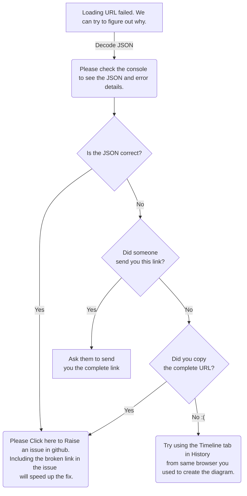

# Memory Package Documentation

## Architecture Overview

The Memory Package is a high-performance storage system for the Multi-Agent Platform, providing persistent storage, caching, and vector embedding capabilities. It follows a layered architecture with clear separation of concerns:



### Key Components

* **Memory Manager**: Central coordination component with caching, providing a unified interface for all memory operations
* **Primary Storage (RedisMemory)**: Redis-based implementation for key-value storage with TTL support
* **Vector Store**: Manages vector embeddings with support for similarity search across multiple backends
* **Utilities**: Serialization, locking mechanisms, and key generation utilities

### Design Patterns

1. **Adapter Pattern**: Each storage backend implements the same interface, allowing seamless swapping
2. **Singleton Pattern**: Connection management and metrics use singletons for efficient resource sharing
3. **Repository Pattern**: Storage components abstract the underlying persistence mechanisms
4. **Strategy Pattern**: Vector store implements multiple backend strategies with dynamic registration
5. **Decorator Pattern**: Metrics and timing functionality wrapped around core operations

### Key Abstractions

* **BaseMemory**: Interface defining core memory operations (load, save, delete, etc.)
* **BaseVectorStore**: Interface for vector operations (store, search, delete)
* **Context-based Storage**: All operations are associated with contexts for logical separation
* **TTL Management**: Automatic expiration of data through configurable TTL policies

## Component Details

### Memory Manager

#### Purpose
The Memory Manager serves as the central coordination point for all memory operations, providing a unified interface with caching and orchestration capabilities.

#### Core Classes
- `MemoryManager`: Main class that coordinates between primary storage, vector store, and cache
- `TTLCache`: Underlying cache implementation with time-based expiration
- `AsyncLock`: Distributed locking mechanism for thread safety

#### Key Features
- Multi-level caching (in-memory L1, Redis L2)
- Automatic TTL management
- Bulk operations for performance
- Context-based isolation
- Distributed locking for concurrency control
- Comprehensive metrics and logging

#### Usage Example

```python
# Initialize Memory Manager
from src.memory.manager import MemoryManager
from src.memory.redis_memory import RedisMemory
from src.memory.vector_store import VectorStore

# Create primary storage
primary_storage = RedisMemory()

# Create vector store
vector_store = VectorStore()

# Create memory manager
memory_manager = MemoryManager(
    primary_memory=primary_storage,
    vector_store=vector_store,
    cache_size=10000,  # Maximum L1 cache entries
    cache_ttl=3600,    # L1 cache TTL in seconds
    memory_ttl=86400   # Default TTL for storage in seconds
)

# Basic operations
await memory_manager.save("user_profile", "user123", {"name": "John", "email": "john@example.com"})
user = await memory_manager.load("user_profile", "user123")
exists = await memory_manager.exists("user_profile", "user123")
await memory_manager.delete("user_profile", "user123")

# Bulk operations
data = {
    "user1": {"name": "Alice"},
    "user2": {"name": "Bob"}
}
await memory_manager.bulk_save(data, "users")
users = await memory_manager.bulk_load(["user1", "user2"], "users")

# Context management
await memory_manager.clear("user123")  # Clear all data for context "user123"
```

#### Best Practices
- Use consistent context IDs to organize related data
- Leverage bulk operations for performance when working with multiple keys
- Consider TTL policies based on data lifetime requirements
- Use `with_cache` and `with_bulk_cache` for function results caching

#### Performance Considerations
- Cache size should be tuned based on memory availability and access patterns
- Operations are optimized for async/await usage
- Lock cleanup is performed periodically to prevent memory leaks
- Metrics track operation durations and sizes for performance monitoring

### Redis Memory

#### Purpose
RedisMemory implements the BaseMemory interface using Redis as the underlying storage engine, providing persistent storage with TTL support.

#### Core Classes
- `RedisMemory`: Implementation of BaseMemory using Redis
- `AsyncLock`: Redis-based distributed locking

#### Key Features
- Persistent key-value storage
- TTL support for automatic expiration
- Efficient bulk operations
- Optimized serialization/deserialization
- Connection pooling for performance

#### Usage Example

```python
from src.memory.redis_memory import RedisMemory

# Initialize Redis Memory
redis_memory = RedisMemory(default_ttl=3600)  # Default TTL of 1 hour

# Basic operations
await redis_memory.save_context("user_profile", "user123", {"name": "John"}, ttl=7200)
data = await redis_memory.load_context("user_profile", "user123")
await redis_memory.delete_context("user_profile", "user123")

# Bulk operations
keys = ["user1", "user2", "user3"]
results = await redis_memory.bulk_load(keys, "profiles")

# Get statistics
stats = await redis_memory.get_stats()
print(f"Total keys: {stats['redis_total_keys']}")
```

#### Best Practices
- Configure appropriate TTL values for different data types
- Use bulk operations when working with multiple keys
- Handle connection errors with appropriate retry strategies
- Monitor Redis memory usage through the stats API

#### Performance Considerations
- Connection pooling reduces connection overhead
- Pipeline commands for bulk operations to reduce round trips
- Serialization uses MessagePack for efficiency with fallbacks to Pickle and JSON
- SCAN operations are paginated to avoid blocking Redis

### Vector Store

#### Purpose
VectorStore manages vector embeddings for semantic search capabilities, supporting multiple backend implementations.

#### Core Classes
- `VectorStore`: Main class implementing the BaseVectorStore interface
- Backend implementations: ChromaDB, FAISS, Qdrant, and in-memory

#### Key Features
- Vector embedding storage and similarity search
- Multiple backend support (in-memory, ChromaDB, FAISS, Qdrant)
- Automatic embedding generation
- Metadata filtering
- Context-based collections
- Efficient in-memory search with NumPy optimization

#### Usage Example

```python
from src.memory.vector_store import VectorStore

# Initialize Vector Store
vector_store = VectorStore()  # Uses in-memory backend by default

# Store a vector
text = "This is a sample document for vector search"
metadata = {"source": "user_input", "category": "sample"}
vector_id = await vector_store.store_vector(
    text=text,
    metadata=metadata,
    context_id="search_demo"
)

# Search for similar vectors
query = "Find documents about searching"
results = await vector_store.search_vectors(
    query=query,
    k=5,  # Number of results
    context_id="search_demo",
    filter_metadata={"category": "sample"}  # Optional filtering
)

# Process results
for result in results:
    print(f"ID: {result['id']}, Score: {result['score']}")
    print(f"Text: {result['metadata']['text']}")
    print("---")

# Delete vectors
await vector_store.delete_vectors(
    ids=[vector_id],
    context_id="search_demo"
)
```

#### Backend Configuration

```python
# ChromaDB backend
vector_store = VectorStore(
    api_url="http://localhost:8000",  # ChromaDB server URL
)

# FAISS backend
vector_store = VectorStore(
    vector_db_type="faiss",
    backend_options={"storage_dir": "/path/to/faiss/storage"}
)

# Qdrant backend
vector_store = VectorStore(
    vector_db_type="qdrant",
    api_url="http://localhost:6333"  # Qdrant server URL
)
```

#### Best Practices
- Choose the appropriate backend based on scale and requirements
- Keep vector dimensions consistent within collections
- Use context IDs to isolate different vector spaces
- Apply metadata filtering to improve search precision
- Monitor vector store size and performance through stats API

#### Performance Considerations
- In-memory backend uses NumPy for optimized similarity calculations
- FAISS and Qdrant provide better scaling for large vector collections
- Embedding generation is cached for repeated texts
- Vector normalization improves similarity search quality

### Utilities

#### Purpose
The utilities module provides shared functionality used across the memory package, including serialization, key generation, and locking mechanisms.

#### Core Functions

- `generate_memory_key`: Creates standardized keys for memory storage
- `generate_vector_key`: Creates standardized keys for vector collections
- `serialize_data`: Efficient data serialization with multiple formats
- `deserialize_data`: Data deserialization with format detection
- `compute_fingerprint`: Creates stable hash fingerprints for data objects
- `matches_pattern`: Pattern matching with wildcard support

#### Key Classes

- `AsyncLock`: Redis-based distributed locking mechanism
- `ExpirationPolicy`: TTL management utilities

#### Usage Example

```python
from src.memory.utils import (
    generate_memory_key, serialize_data, deserialize_data,
    compute_fingerprint, AsyncLock
)

# Key generation
key = generate_memory_key("user_profile", "user123")  # "memory:user123:user_profile"

# Serialization
data = {"name": "John", "scores": [95, 87, 92]}
serialized = await serialize_data(data)  # Uses MessagePack by default

# Deserialization
original_data = await deserialize_data(serialized)

# Fingerprinting
fingerprint = compute_fingerprint(data)  # SHA-256 hash

# Distributed locking
async with AsyncLock(redis_client, "update_user123", expire_time=10) as lock:
    # Critical section with exclusive access
    await update_user_data()
```

#### Best Practices
- Use the standard key generation functions for consistency
- Handle serialization errors with appropriate fallbacks
- Keep lock timeouts short to prevent deadlocks
- Use fingerprinting for efficient caching and deduplication

## Usage Examples

### Basic Storage Operations

```python
from src.memory.manager import MemoryManager
from src.memory.redis_memory import RedisMemory

# Initialize components
redis_memory = RedisMemory()
memory_manager = MemoryManager(primary_memory=redis_memory)

async def basic_operations_example():
    # Save data with context
    user_data = {
        "name": "Alice",
        "email": "alice@example.com",
        "preferences": {
            "theme": "dark",
            "notifications": True
        }
    }
    
    # Save with 1-hour TTL
    await memory_manager.save(
        key="user_profile",
        context_id="user_abc123",
        data=user_data,
        ttl=3600
    )
    
    # Check existence
    exists = await memory_manager.exists("user_profile", "user_abc123")
    print(f"Profile exists: {exists}")
    
    # Load data
    profile = await memory_manager.load("user_profile", "user_abc123")
    print(f"User name: {profile['name']}")
    
    # Update data
    profile["preferences"]["theme"] = "light"
    await memory_manager.save("user_profile", "user_abc123", profile)
    
    # Delete data
    await memory_manager.delete("user_profile", "user_abc123")
    
    # Verify deletion
    exists = await memory_manager.exists("user_profile", "user_abc123")
    print(f"Profile exists after deletion: {exists}")
```

### Bulk Operations

```python
async def bulk_operations_example():
    # Prepare bulk data
    users = {
        "user1": {"name": "Alice", "role": "admin"},
        "user2": {"name": "Bob", "role": "user"},
        "user3": {"name": "Charlie", "role": "user"}
    }
    
    # Save bulk data
    await memory_manager.bulk_save(users, "team_alpha")
    
    # Load specific keys
    team_members = await memory_manager.bulk_load(
        keys=["user1", "user3"],
        context_id="team_alpha"
    )
    
    # Process results
    for user_id, user_data in team_members.items():
        print(f"User {user_id}: {user_data['name']} ({user_data['role']})")
    
    # Clear context
    await memory_manager.clear("team_alpha")
```

### Vector Search

```python
from src.memory.vector_store import VectorStore

async def vector_search_example():
    # Initialize vector store
    vector_store = VectorStore()
    
    # Sample documents
    documents = [
        "Machine learning is a field of artificial intelligence that uses statistical techniques to give computer systems the ability to learn from data.",
        "Natural language processing is a subfield of artificial intelligence focused on enabling computers to understand and process human language.",
        "Computer vision is an interdisciplinary field that deals with how computers can gain high-level understanding from digital images or videos.",
        "Reinforcement learning is an area of machine learning concerned with how intelligent agents take actions to maximize cumulative reward."
    ]
    
    # Store documents with metadata
    for i, doc in enumerate(documents):
        category = "ai" if "artificial intelligence" in doc.lower() else "computer_science"
        
        await vector_store.store_vector(
            text=doc,
            metadata={
                "document_id": f"doc_{i}",
                "category": category,
                "length": len(doc)
            },
            context_id="knowledge_base"
        )
    
    # Search for similar documents
    query = "How do computers understand human language?"
    results = await vector_store.search_vectors(
        query=query,
        k=2,  # Return top 2 results
        context_id="knowledge_base"
    )
    
    # Display results
    for i, result in enumerate(results):
        print(f"Result {i+1} (Score: {result['score']:.4f}):")
        print(f"Text: {result['metadata']['text']}")
        print(f"Category: {result['metadata']['category']}")
        print("---")
    
    # Search with filtering
    filtered_results = await vector_store.search_vectors(
        query="machine learning applications",
        k=2,
        context_id="knowledge_base",
        filter_metadata={"category": "ai"}  # Only return AI category
    )
    
    print("\nFiltered Results:")
    for i, result in enumerate(filtered_results):
        print(f"Result {i+1} (Score: {result['score']:.4f}):")
        print(f"Text: {result['metadata']['text']}")
```

### Caching Expensive Operations

```python
async def caching_example():
    # Define an expensive operation
    async def fetch_user_recommendations(user_id: str) -> list:
        print(f"Computing recommendations for user {user_id}...")
        # Simulate expensive operation
        await asyncio.sleep(2)
        return [f"item_{i}" for i in range(1, 6)]
    
    # Get recommendations with caching
    async def get_recommendations(user_id: str):
        # This will cache the result with 15-minute TTL
        return await memory_manager.with_cache(
            func=lambda: fetch_user_recommendations(user_id),
            key=f"recommendations",
            context_id=user_id,
            ttl=900,  # 15 minutes
            force_refresh=False  # Set to True to bypass cache
        )
    
    # First call (cache miss)
    start = time.time()
    recommendations = await get_recommendations("user123")
    print(f"First call took {time.time() - start:.2f}s")
    print(f"Recommendations: {recommendations}")
    
    # Second call (cache hit)
    start = time.time()
    recommendations = await get_recommendations("user123")
    print(f"Second call took {time.time() - start:.2f}s")
    print(f"Recommendations: {recommendations}")
```

### Error Handling

```python
from src.config.errors import MemoryError, ErrorCode

async def error_handling_example():
    try:
        # Attempt to load non-existent data
        data = await memory_manager.load(
            key="nonexistent_key",
            context_id="unknown_context",
            default={"status": "not_found"}  # Provide default for not found
        )
        
        if data["status"] == "not_found":
            print("Data not found, using default value")
        
        # Attempt vector operation with error handling
        try:
            results = await memory_manager.search_vectors(
                query="test query",
                context_id="nonexistent_context"
            )
            
            if not results:
                print("No vector results found")
            
        except MemoryError as e:
            if e.code == ErrorCode.VECTOR_DB_ERROR:
                print(f"Vector database error: {e.message}")
            else:
                print(f"Memory error: {e.code} - {e.message}")
                
    except Exception as e:
        print(f"Unexpected error: {str(e)}")
```

## Best Practices

### General Guidelines

1. **Context-Based Organization**
   - Use meaningful context IDs to organize related data
   - Consider hierarchical context structures for complex applications
   - Keep context IDs consistent across vector and key-value storage

2. **Efficient Data Access**
   - Use bulk operations when working with multiple keys
   - Leverage caching for expensive computations
   - Consider read/write patterns when designing key structures

3. **Error Handling**
   - Always provide default values for loads to handle missing data gracefully
   - Use the custom error types for consistent error handling
   - Implement appropriate retry strategies for transient failures

4. **Resource Management**
   - Monitor memory usage with the stats API
   - Implement periodic cleanup for unused contexts
   - Configure appropriate TTL values based on data lifetime requirements

5. **Vector Search Optimization**
   - Keep vector embeddings normalized for consistent similarity results
   - Use metadata filtering to improve search precision
   - Choose vector backends based on scale requirements

### Specific Recommendations

#### Key Naming Conventions

```python
# Good: Descriptive, hierarchical keys
await memory_manager.save("user:profile", user_id, data)
await memory_manager.save("user:preferences", user_id, prefs)

# Avoid: Flat, non-descriptive keys
await memory_manager.save("data1", user_id, data)
```

#### TTL Strategies

```python
# Session data: Short TTL
await memory_manager.save("session", session_id, session_data, ttl=1800)  # 30 minutes

# User profiles: Longer TTL
await memory_manager.save("user_profile", user_id, profile_data, ttl=604800)  # 1 week

# Cached computations: Medium TTL
await memory_manager.save("computed_stats", "daily", stats, ttl=3600)  # 1 hour
```

#### Performance Optimization

```python
# Bulk load with default values
keys_to_load = ["setting1", "setting2", "setting3"]
settings = await memory_manager.bulk_load(
    keys=keys_to_load,
    context_id="app_config",
    default=None  # Default for missing keys
)

# Using with_bulk_cache for expensive operations on multiple keys
async def get_user_data(user_ids):
    return await memory_manager.with_bulk_cache(
        func=lambda ids: fetch_user_data_from_db(ids),
        keys=user_ids,
        context_id="user_profiles",
        ttl=3600
    )
```

#### Cache Management

```python
# Invalidate specific cache entries
await memory_manager.invalidate_cache(
    key="user_profile",
    context_id=user_id
)

# Invalidate by pattern
await memory_manager.invalidate_cache(
    context_id=user_id,
    pattern="notification:*"
)

# Monitor cache hit rates
cache_stats = await memory_manager.get_stats()
print(f"Cache size: {cache_stats['manager']['cache_current_items']}")
```

## Testing Approach

### Test Structure

The memory package uses pytest for testing, with a focus on:

1. **Unit Tests**: Testing individual components in isolation
2. **Integration Tests**: Testing component interactions
3. **Mock-based Tests**: Using mocks for external dependencies
4. **Performance Tests**: Ensuring efficient operation
5. **Fix Verification Tests**: Specifically testing fixed issues

### Key Test Files

The package includes several test files designed to verify specific improvements:

1. **`vector_store_test.py`**: Tests the NumPy-optimized vector search implementation, verifying performance improvements (should be at least 2x faster than the fallback method) and ensuring search accuracy with filtering.

2. **`memory_manager_test.py`**: Verifies the time-based lock cleanup mechanism, confirming that lock cleanup now happens deterministically based on time intervals rather than random probability, preventing memory leaks.

3. **`string_formatting_test.py`**: Ensures f-strings with embedded quotes are correctly formatted and don't cause syntax errors, validating the fixes for string formatting issues across the package.

### Running Tests

```bash
# Run all memory tests
python -m pytest tests/memory -v

# Run specific test file
python -m pytest tests/memory/test_memory.py -v

# Run tests with coverage
python -m pytest tests/memory --cov=src.memory

# Run integration tests only
python -m pytest tests/memory -m integration
```

### Key Test Fixtures

```python
# Mock Redis fixture
@pytest.fixture
def mock_redis():
    """Create a mock Redis client"""
    redis_mock = AsyncMock()
    redis_mock.get = AsyncMock(return_value=None)
    redis_mock.set = AsyncMock(return_value=True)
    # ... other Redis methods
    return redis_mock

# Memory Manager fixture
@pytest.fixture
def memory_manager(mock_metrics):
    """Create a memory manager with mocked dependencies"""
    # Create mock primary memory
    primary_memory = AsyncMock(spec=BaseMemory)
    # Create mock vector store
    vector_store = AsyncMock(spec=BaseVectorStore)
    # Create memory manager with mocks
    manager = MemoryManager(
        primary_memory=primary_memory,
        vector_store=vector_store
    )
    return manager
```

### Testing Patterns

1. **Dependency Isolation**: Using mocks to isolate component dependencies
2. **Parametrized Tests**: Testing multiple input variations
3. **Async Testing**: Using pytest-asyncio for testing async functions
4. **Error Condition Testing**: Verifying correct error handling
5. **Performance Assertions**: Ensuring operations meet performance requirements
6. **Comparative Testing**: Comparing optimized implementations against fallbacks

### Example Test Cases

#### Testing Vector Store Optimization

```python
@pytest.mark.asyncio
class TestVectorStoreOptimization:
    
    async def test_optimized_vector_search(self):
        """Test that optimized vector search is faster than fallback method."""
        # Create vector store instance
        vector_store = VectorStore()
        
        # Generate test data - 1000 random vectors
        num_vectors = 1000
        vector_dim = 384
        np.random.seed(42)
        
        # Create random unit vectors
        test_vectors = []
        for i in range(num_vectors):
            vec = np.random.randn(vector_dim).astype(np.float32)
            vec = vec / np.linalg.norm(vec)
            test_vectors.append(vec.tolist())
        
        # Store vectors in memory
        for i, vector in enumerate(test_vectors):
            vector_store._in_memory_vectors.setdefault("test_collection", {})
            vector_store._in_memory_vectors["test_collection"][f"id_{i}"] = {
                'id': f"id_{i}",
                'vector': vector,
                'metadata': {'category': 'test' if i % 2 == 0 else 'other'}
            }
        
        # Test optimized search (with NumPy)
        start_time = time.time()
        optimized_results = await vector_store._search_vectors_memory(
            query_vector=query_vector,
            k=10,
            collection="test_collection",
            filter_metadata={"category": "test"}
        )
        optimized_time = time.time() - start_time
        
        # Force fallback to pure Python implementation
        with patch('numpy.array', side_effect=ImportError("Forced fallback")):
            start_time = time.time()
            fallback_results = await vector_store._search_vectors_memory(
                query_vector=query_vector,
                k=10,
                collection="test_collection",
                filter_metadata={"category": "test"}
            )
            fallback_time = time.time() - start_time
        
        # Verify performance improvement (at least 2x faster)
        performance_ratio = fallback_time / optimized_time
        assert performance_ratio > 2.0
```

#### Testing Memory Manager Lock Cleanup

```python
@pytest.mark.asyncio
class TestMemoryManagerLocks:
    
    async def test_lock_cleanup_timing(self):
        """Test that lock cleanup happens based on time intervals."""
        # Create memory manager
        memory_manager = MemoryManager(primary_memory=mock_primary)
        
        # Set the last cleanup time to a known value
        memory_manager._last_locks_cleanup = time.monotonic() - 70  # 70 seconds ago
        
        # Create a large number of locks
        for i in range(150):
            await memory_manager._get_cache_lock(f"test_key_{i}")
            
        # Request another lock, which should trigger cleanup
        await memory_manager._get_cache_lock("trigger_cleanup")
        
        # Verify cleanup happened and timestamp was updated
        assert memory_manager._last_locks_cleanup > time.monotonic() - 5
        assert len(memory_manager._cache_locks) < 150
```

## Implementation Notes

### Design Decisions

1. **Layered Architecture**
   - The MemoryManager wraps primary storage and provides caching
   - RedisMemory handles persistence with connection pooling
   - VectorStore supports multiple backends through a consistent interface

2. **Asynchronous Design**
   - All operations are async to support high concurrency
   - Uses asyncio primitives for locking and coordination
   - Efficient task management to avoid blocking

3. **Error Handling**
   - Custom error hierarchy with detailed error codes
   - Consistent error conversion for external dependencies
   - Default values to handle missing data gracefully

4. **Serialization Strategy**
   - Multi-format serialization with automatic selection
   - MessagePack for efficient binary serialization
   - Fallbacks to Pickle and JSON for complex types

### Thread Safety

1. **Async Locks**
   - Distributed locking with Redis for cross-process safety
   - Local asyncio locks for in-process concurrency
   - Lock cleanup to prevent resource leaks

2. **Connection Management**
   - Thread-safe connection pooling with connection reuse
   - Automatic connection recovery and cleanup
   - Resource limiting to prevent connection exhaustion

### Performance Optimizations

1. **Caching**
   - Multi-level caching (in-memory L1, Redis L2)
   - TTL-based expiration to manage memory usage
   - Bulk operations to reduce round trips

2. **Vector Operations**
   - NumPy-based similarity calculations for optimized performance
   - Normalized vectors for efficient cosine similarity
   - Batch processing for similarity search

3. **Redis Optimizations**
   - Pipeline commands for bulk operations
   - Connection pooling for connection reuse
   - Efficient key patterns and scanning

4. **Memory Management**
   - Periodic cleanup of unused resources
   - TTL strategies for different data types
   - Resource monitoring and metrics

## API Reference

### MemoryManager

```python
class MemoryManager:
    """Manager for memory storage with caching."""
    
    def __init__(
        self, 
        primary_memory: BaseMemory, 
        vector_store: Optional[BaseVectorStore]=None, 
        cache_size: int=10000, 
        cache_ttl: int=3600, 
        memory_ttl: int=86400
    ):
        """
        Initialize the memory manager.
        
        Args:
            primary_memory: Primary storage backend
            vector_store: Optional vector storage backend
            cache_size: Maximum number of cache entries
            cache_ttl: Cache TTL in seconds
            memory_ttl: Default memory storage TTL in seconds
        """
        
    async def load(
        self, key: str, context_id: str, 
        default: Any=None, use_cache: bool=True
    ) -> Any:
        """
        Load data with caching support.
        
        Args:
            key: The key to load
            context_id: The context identifier
            default: Default value to return if key not found
            use_cache: Whether to use the cache
            
        Returns:
            The stored data or default if not found
        """
        
    async def save(
        self, key: str, context_id: str, 
        data: Any, ttl: Optional[int]=None, 
        update_cache: bool=True
    ) -> bool:
        """
        Save data with cache update.
        
        Args:
            key: The key to save
            context_id: The context identifier
            data: The data to save
            ttl: Time-to-live in seconds, or None for default
            update_cache: Whether to update the cache
            
        Returns:
            bool: True if save was successful
        """
        
    async def delete(
        self, key: str, context_id: str, 
        clear_cache: bool=True
    ) -> bool:
        """
        Delete data with cache invalidation.
        
        Args:
            key: The key to delete
            context_id: The context identifier
            clear_cache: Whether to clear from cache
            
        Returns:
            bool: True if deletion was successful
        """
        
    async def clear(
        self, context_id: Optional[str]=None, 
        clear_cache: bool=True, 
        clear_vectors: bool=True
    ) -> bool:
        """
        Clear all data for a context, or all contexts if none specified.
        
        Args:
            context_id: The context identifier, or None for all
            clear_cache: Whether to clear from cache
            clear_vectors: Whether to clear from vector store
            
        Returns:
            bool: True if clearing was successful
        """
        
    # Additional methods documented similarly...
```

### RedisMemory

```python
class RedisMemory(BaseMemory):
    """Redis-based implementation of memory storage system."""
    
    def __init__(self, default_ttl: Optional[int]=None):
        """
        Initialize Redis memory storage.
        
        Args:
            default_ttl: Default TTL in seconds
        """
        
    async def load_context(
        self, key: str, context_id: str, 
        default: Any=None
    ) -> Any:
        """
        Load context data from Redis.
        
        Args:
            key: The key to load
            context_id: The context identifier
            default: Default value to return if key not found
            
        Returns:
            The stored data or default if not found
        """
        
    async def save_context(
        self, key: str, context_id: str, 
        data: Any, ttl: Optional[int]=None
    ) -> bool:
        """
        Save context data to Redis.
        
        Args:
            key: The key to save
            context_id: The context identifier
            data: The data to save
            ttl: Time-to-live in seconds, or None for default
            
        Returns:
            bool: True if save was successful
        """
        
    # Additional methods documented similarly...
```

### VectorStore

```python
class VectorStore(BaseVectorStore):
    """Vector storage system supporting multiple backends."""
    
    def __init__(
        self, api_url: Optional[str]=None, 
        api_key: Optional[str]=None, 
        backend_options: Optional[Dict[str, Any]]=None
    ):
        """
        Initialize vector store with configuration.
        
        Args:
            api_url: URL for the vector database API
            api_key: Optional API key for authentication
            backend_options: Optional additional configuration
        """
        
    async def store_vector(
        self, text: str, metadata: Dict[str, Any], 
        vector: Optional[List[float]]=None, 
        context_id: Optional[str]=None
    ) -> str:
        """
        Store a vector with associated text and metadata.
        
        Args:
            text: The text associated with the vector
            metadata: Additional metadata to store
            vector: Optional pre-computed vector embedding
            context_id: Optional context identifier
            
        Returns:
            str: ID of the stored vector
        """
        
    async def search_vectors(
        self, query: str, k: int=5, 
        context_id: Optional[str]=None, 
        filter_metadata: Optional[Dict[str, Any]]=None
    ) -> List[Dict[str, Any]]:
        """
        Search for vectors similar to the query.
        
        Args:
            query: The search query
            k: Number of results to return
            context_id: Optional context identifier
            filter_metadata: Optional filter to apply to metadata
            
        Returns:
            List[Dict[str, Any]]: Search results with similarity scores
        """
        
    # Additional methods documented similarly...
```

## Integration Guidelines

### Initialization Sequence

```python
# Import necessary components
from src.memory.redis_memory import RedisMemory
from src.memory.vector_store import VectorStore
from src.memory.manager import MemoryManager

async def initialize_memory_system():
    # Step 1: Initialize primary storage
    redis_memory = RedisMemory(default_ttl=86400)  # 1 day default TTL
    
    # Step 2: Initialize vector store with appropriate backend
    vector_store = VectorStore(
        api_url="http://vector-db:8000",  # Optional external service
        backend_options={"storage_dir": "/data/vectors"}  # For FAISS
    )
    
    # Step 3: Create memory manager with components
    memory_manager = MemoryManager(
        primary_memory=redis_memory,
        vector_store=vector_store,
        cache_size=10000,
        cache_ttl=3600,
        memory_ttl=86400
    )
    
    return memory_manager
```

### Configuration Options

```python
# Memory system configuration
memory_config = {
    # Redis configuration
    "redis_url": "redis://redis:6379/0",
    "redis_password": "secure_password",
    "redis_pool_size": 20,
    
    # Memory TTL settings
    "default_ttl": 86400,        # 1 day
    "cache_ttl": 3600,           # 1 hour
    "temporary_ttl": 300,        # 5 minutes
    "persistent_ttl": 2592000,   # 30 days
    
    # Cache settings
    "cache_size": 10000,
    "cache_cleanup_interval": 60,  # seconds
    
    # Vector store settings
    "vector_db_type": "faiss",   # or "chroma", "qdrant", "none"
    "vector_db_url": "http://vector-db:8000",
    "vector_storage_dir": "/data/vectors"
}
```

### Dependency Management

```python
# Required dependencies
dependencies = [
    "redis>=4.3.0",
    "hiredis>=2.0.0",
    "msgpack>=1.0.3",
    "numpy>=1.21.0",
    "aiohttp>=3.8.1",
    "cachetools>=5.0.0",
]

# Optional backend-specific dependencies
vector_db_dependencies = {
    "chroma": ["chromadb>=0.3.0"],
    "faiss": ["faiss-cpu>=1.7.0"],  # or faiss-gpu
    "qdrant": ["qdrant-client>=1.0.0"]
}
```

### Resource Lifecycle Management

```python
async def cleanup_memory_resources():
    # Get connection manager singleton
    conn_manager = get_connection_manager()
    
    # Close all connections
    await conn_manager.close_all_connections()
    
    # Stop metrics server if running
    metrics_manager = get_metrics_manager()
    if metrics_manager.enabled and metrics_manager._server_started:
        # Server runs in daemon thread, will terminate with process
        logger.info("Metrics server will terminate with process")
    
    logger.info("Memory resources cleaned up successfully")
```

## Key Improvements

### Bug Fixes

1. **Missing Imports**
   - Added missing imports in all modules (random, re, cast)
   - Fixed circular import issues with metrics and settings

2. **String Formatting Errors**
   - Fixed incorrect use of single quotes in f-strings
   - Standardized string formatting across all modules

3. **Type Safety**
   - Added proper type handling for Redis responses
   - Improved TypeVar usage for generic return types
   - Fixed inconsistent return type annotations

### Performance Improvements

1. **Vector Search Optimization**
   - Implemented NumPy-based vector operations for significantly faster similarity search
   - Added batch processing for vector operations
   - Optimized normalization for cosine similarity

2. **Lock Management**
   - Replaced random-based lock cleanup with time-based approach
   - Added upper limit on lock retention to prevent memory leaks
   - Improved lock acquisition with exponential backoff

3. **Connection Efficiency**
   - Implemented connection pooling with connection manager
   - Added connection timeout and retry with jitter
   - Optimized Redis pipeline usage for bulk operations

### Architecture Enhancements

1. **Error Handling**
   - Standardized error conversion for external dependencies
   - Added detailed error context and logging
   - Improved error recovery with fallback mechanisms

2. **Metrics Integration**
   - Added comprehensive performance metrics
   - Standardized metric tracking across components
   - Improved timing and size tracking

3. **Modular Vector Backends**
   - Implemented dynamic backend registration
   - Added support for multiple vector database backends
   - Improved backend configuration options