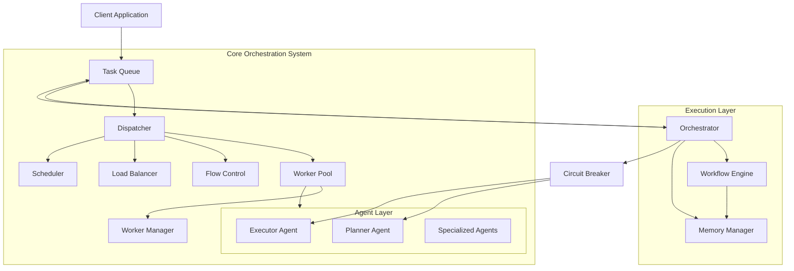

# High-Performance Multi-Agent Orchestration System Documentation

## Architecture Overview

The multi-agent orchestration system provides a robust, asynchronous framework for distributing and executing tasks across a fleet of specialized agents. The architecture follows a distributed systems approach with a focus on resilience, throughput, and extensibility.



### Key Components and Responsibilities

| Component | Responsibility |
|-----------|----------------|
| **Dispatcher** | Routes tasks to appropriate agents, handles retries and DLQ |
| **Flow Control** | Implements rate limiting using GCRA algorithm |
| **Load Balancer** | Distributes tasks among available workers |
| **Scheduler** | Prioritizes tasks based on importance |
| **Task Queue** | Provides reliable task delivery using Redis streams |
| **Worker Pool** | Manages concurrent execution of tasks |
| **Orchestrator** | Coordinates high-level workflow execution |
| **Workflow Engine** | Executes multi-step workflows with state tracking |

### Design Patterns

The system implements several design patterns:

1. **Factory Pattern**: Used in `create_load_balancer()` to instantiate appropriate load balancer strategies
2. **Strategy Pattern**: Multiple load balancing strategies (Round Robin, Random, Weighted) 
3. **Singleton Pattern**: Used for shared resources like scheduler and workflow engine
4. **Circuit Breaker Pattern**: Prevents cascading failures in agent execution
5. **Command Pattern**: Tasks as command objects that can be queued, prioritized and executed
6. **Observer Pattern**: Metrics collection and monitoring of system health

### Key Abstractions

- **Task**: A unit of work to be performed by an agent
- **Agent**: Entity that processes tasks (e.g., LLM-based processors)
- **Workflow**: A multi-step execution plan with dependencies
- **Backpressure**: System mechanism to handle overload conditions

## Component Details

### Dispatcher (`dispatcher.py`)

#### Purpose and Responsibilities
The Dispatcher routes tasks to appropriate agents, manages task execution, handles retries for failed tasks, and moves permanently failed tasks to a Dead Letter Queue (DLQ).

#### Core Classes
- `Dispatcher`: Main class that distributes tasks to agents

#### Key Features
- Reliable task delivery with at-least-once execution semantics
- Automatic retries with exponential backoff for transient failures
- Dead Letter Queue (DLQ) handling for failed tasks
- Flow control to prevent system overload
- Detailed metrics and logging for observability

#### Usage Example

```python
# Initialize a dispatcher
task_queue = RedisStreamTaskQueue("task_stream", "consumer_group")
scheduler = PriorityScheduler()
worker_pool = QueueWorkerPool("dispatcher_pool")
flow_controller = get_flow_controller("dispatcher_flow")

dispatcher = Dispatcher(
    task_queue=task_queue,
    scheduler=scheduler,
    worker_pool=worker_pool,
    flow_controller=flow_controller
)

# Start the dispatcher
await dispatcher.run()

# Submit a task
task_data = {
    "id": "task-123",
    "type": "text_classification",
    "input": {"text": "Classify this text"},
    "priority": TaskPriority.HIGH.value
}
await task_queue.produce(task_data)

# Stop the dispatcher when done
await dispatcher.stop()
```

#### Public Interface

| Method | Description |
|--------|-------------|
| `__init__(task_queue, ...)` | Initialize with task queue and optional components |
| `run()` | Start the dispatcher processing loop |
| `stop()` | Gracefully stop the dispatcher |

#### Best Practices
- Always provide unique task IDs to ensure deduplication
- Set appropriate retry counts based on task criticality
- Monitor DLQ for persistent task failures
- Implement proper exception handling for agent failures

#### Performance Considerations
- The dispatcher uses a semaphore to limit concurrent task processing
- Tasks can be prioritized to handle high-priority work first
- Flow control prevents system overload during traffic spikes

### Flow Control (`flow_control.py`)

#### Purpose and Responsibilities
The Flow Control component implements rate limiting to protect downstream systems from overload. It uses the Generic Cell Rate Algorithm (GCRA) for precise and efficient rate limiting.

#### Core Classes
- `RedisRateLimiter`: Redis-based rate limiter implementing GCRA
- `BackpressureConfig`: Configuration for rate limiting parameters
- `BackpressureStrategy`: Strategies for handling overload (currently REJECT)

#### Key Features
- Token bucket-like rate limiting with Redis for distributed use
- Configurable rate and burst capacity
- Priority-based permit allocation
- Metrics for monitoring rate limit rejections
- Async context manager support

#### Usage Example

```python
# Configure and initialize a rate limiter
config = BackpressureConfig(
    rate_limit=RateLimitConfig(rate=100.0, burst=50)
)
rate_limiter = RedisRateLimiter("api_limiter", config)

# Execute a function with rate limiting
async def process_request(request_id):
    # Process the request
    return {"status": "success", "id": request_id}

try:
    result = await rate_limiter.execute(
        process_request, 
        "request-123",
        priority=1,  # Higher priority
        cost=2       # Consumes 2 tokens
    )
    print(f"Request processed: {result}")
except BackpressureRejectedError:
    print("Request rejected due to rate limiting")

# Alternative: use as context manager
try:
    async with rate_limiter:
        result = await process_request("request-123")
        print(f"Request processed: {result}")
except BackpressureRejectedError:
    print("Request rejected due to rate limiting")
```

#### Public Interface

| Method | Description |
|--------|-------------|
| `__init__(name, config)` | Initialize with rate limiter name and config |
| `acquire(priority, cost)` | Attempt to acquire a permit |
| `release()` | Release a permit (no-op for REJECT strategy) |
| `execute(func, *args, **kwargs)` | Execute a function with rate limiting |

#### Best Practices
- Set appropriate rate limits based on downstream capacity
- Use different rate limiters for different resource types
- Monitor rejection rates to adjust limits
- Consider priority for critical operations

#### Performance Considerations
- Redis operations are kept minimal with an optimized Lua script
- GCRA algorithm provides precise rate limiting with O(1) complexity
- Shared script SHA across instances reduces Redis load

### Load Balancer (`load_balancer.py`)

#### Purpose and Responsibilities
The Load Balancer distributes tasks among available workers using various strategies to optimize resource utilization and prevent overloading individual workers.

#### Core Classes
- `BaseLoadBalancerStrategy`: Abstract base class for load balancing strategies
- `RoundRobinStrategy`: Distributes tasks in a circular sequence
- `RandomStrategy`: Randomly selects workers
- `WeightedRoundRobinStrategy`: Distributes tasks based on worker capacity

#### Key Features
- Multiple distribution strategies for different workloads
- Dynamic worker weighting for capacity-aware distribution
- Runtime strategy selection
- Worker status updates for adaptive balancing

#### Usage Example

```python
# Create a load balancer
load_balancer = create_load_balancer("weighted_round_robin")

# Set worker weights for weighted strategies
if isinstance(load_balancer, WeightedRoundRobinStrategy):
    load_balancer.set_worker_weight("worker1", 3)  # Can handle 3x the load
    load_balancer.set_worker_weight("worker2", 1)
    load_balancer.set_worker_weight("worker3", 2)

# Use load balancer to select a worker
available_workers = ["worker1", "worker2", "worker3"]
selected_worker = load_balancer.select_worker(available_workers)

# Update worker status based on current capacity
load_balancer.update_worker_status("worker1", {"weight": 2})  # Reduced capacity
```

#### Public Interface

| Method | Description |
|--------|-------------|
| `select_worker(available_workers, task_info)` | Select a worker for a task |
| `update_worker_status(worker_id, status)` | Update worker status information |
| `set_worker_weight(worker_id, weight)` | Set weight for a worker (WeightedRoundRobinStrategy) |

#### Best Practices
- Choose the strategy based on your workload characteristics
- Update worker weights based on actual capacity
- Consider task characteristics when selecting workers
- Monitor distribution patterns to ensure proper balance

#### Performance Considerations
- All strategies have O(1) selection complexity
- Weighted strategies have additional memory overhead
- Strategies are thread-safe for concurrent use

### Worker Pool (`orchestration_worker_pool.py`)

#### Purpose and Responsibilities
The Worker Pool manages a collection of worker tasks that execute jobs asynchronously, handling concurrency, queuing, and resource management.

#### Core Classes
- `QueueWorkerPool`: Manages a pool of worker tasks with a queue
- `OrchestrationWorkerPoolConfig`: Configuration for the worker pool
- `OrchestrationWorkerPoolMetrics`: Metrics for monitoring pool performance

#### Key Features
- Asynchronous task execution with concurrency control
- Task queuing with prioritization
- Detailed performance metrics
- Graceful shutdown with task completion
- Resource limit enforcement
- Worker status monitoring

#### Usage Example

```python
# Create a worker pool
pool_config = OrchestrationWorkerPoolConfig(
    workers=4,               # Number of worker tasks
    max_queue_size=100,      # Maximum queued tasks
    max_concurrent_tasks=8   # Maximum executing tasks
)
worker_pool = QueueWorkerPool("processing_pool", config=pool_config)

# Submit tasks to the pool
async def process_item(item_id):
    # Process the item
    print(f"Processing item {item_id}")
    return {"id": item_id, "status": "processed"}

# Submit multiple tasks
for i in range(10):
    await worker_pool.submit(process_item, f"item-{i}")

# Check pool metrics
print(f"Active workers: {worker_pool.metrics.active_workers}")
print(f"Running tasks: {worker_pool.metrics.running_tasks}")
print(f"Queue size: {worker_pool.get_queue_size()}")

# Shutdown the pool when done
await worker_pool.shutdown(wait=True, timeout=30.0)
```

#### Public Interface

| Method | Description |
|--------|-------------|
| `__init__(name, config)` | Initialize with pool name and config |
| `submit(func, *args, **kwargs)` | Submit a task to the worker pool |
| `shutdown(wait, timeout)` | Shut down the worker pool |
| `get_active_workers()` | Get number of active workers |
| `get_queue_size()` | Get current queue size |
| `get_running_tasks()` | Get current number of running tasks |

#### Best Practices
- Size the worker pool based on available CPU cores
- Set max_concurrent_tasks to control resource usage
- Implement proper error handling in submitted tasks
- Monitor queue depth to detect backpressure
- Implement graceful shutdown in your application

#### Performance Considerations
- Worker pool uses a semaphore to limit concurrent task execution
- Task submission is lightweight but queue can become a bottleneck
- Memory usage scales with queue size and worker count
- Consider task execution time when sizing the pool

### Scheduler (`scheduler.py`)

#### Purpose and Responsibilities
The Scheduler prioritizes tasks based on their importance, ensuring high-priority tasks are executed first while maintaining fairness.

#### Core Classes
- `PriorityScheduler`: Schedules tasks based on priority levels
- `TaskPriority`: Enum defining priority levels (CRITICAL, HIGH, NORMAL, LOW)

#### Key Features
- Priority-based task scheduling
- Fair execution within priority levels
- Queue size monitoring
- Task peeking without removal
- Priority queue-based implementation

#### Usage Example

```python
# Initialize the scheduler
scheduler = PriorityScheduler()

# Add tasks with different priorities
await scheduler.add_task({
    "id": "task1",
    "type": "data_processing",
    "priority": TaskPriority.HIGH.value
})

await scheduler.add_task({
    "id": "task2",
    "type": "data_processing",
    "priority": TaskPriority.NORMAL.value
})

await scheduler.add_task({
    "id": "task3",
    "type": "data_processing",
    "priority": TaskPriority.CRITICAL.value
})

# Get next task to process (will be task3 due to CRITICAL priority)
next_task = await scheduler.get_next_task()
print(f"Processing task: {next_task['id']}")

# Peek at next task without removing it
peek_task = await scheduler.peek_next_task()
print(f"Next task in queue: {peek_task['id']}")

# Get multiple tasks ordered by priority
tasks = await scheduler.get_tasks_by_priority(count=10)
print(f"Retrieved {len(tasks)} tasks")

# Clear the scheduler if needed
await scheduler.clear()
```

#### Public Interface

| Method | Description |
|--------|-------------|
| `__init__(max_size)` | Initialize with optional maximum queue size |
| `add_task(task_data)` | Add a task to the priority queue |
| `get_next_task(timeout)` | Get the next task based on priority |
| `peek_next_task()` | Peek at the next task without removing it |
| `get_tasks_by_priority(count)` | Get multiple tasks ordered by priority |
| `get_queue_size()` | Get current queue size |
| `is_empty()` | Check if queue is empty |
| `clear()` | Clear all tasks from the queue |
| `join()` | Wait for all scheduled tasks to be processed |

#### Best Practices
- Set appropriate priorities based on task importance
- Monitor queue size to detect backlog
- Implement timeout handling for `get_next_task`
- Use singleton pattern via `get_scheduler()` for shared instance

#### Performance Considerations
- Priority queue offers O(log n) insertion and removal
- Large queues may impact memory usage
- Consider queue size limits for memory-constrained environments

### Task Queue (`task_queue.py`)

#### Purpose and Responsibilities
The Task Queue provides reliable task delivery with at-least-once execution semantics, using Redis streams for persistence and distribution.

#### Core Classes
- `BaseTaskQueue`: Abstract base class for task queues
- `RedisStreamTaskQueue`: Implementation using Redis streams

#### Key Features
- Persistent task storage in Redis streams
- Consumer group support for distributed processing
- Dead letter queue for failed tasks
- Message acknowledgment to ensure processing
- Pending message handling and reclaiming
- Distributed locking for concurrent operations

#### Usage Example

```python
# Initialize the task queue
task_queue = RedisStreamTaskQueue(
    stream_name="task_stream",
    consumer_group="processing_group",
    claim_interval_ms=60000  # Reclaim messages idle for 60 seconds
)

# Produce a task
task_data = {
    "id": "task-123",
    "type": "image_processing",
    "input": {"image_url": "https://example.com/image.jpg"}
}
message_id = await task_queue.produce(task_data)
print(f"Produced task with ID: {message_id}")

# Consume tasks
consumer_name = "worker-1"
tasks = await task_queue.consume(
    consumer_name=consumer_name,
    count=10,
    block_ms=2000
)

# Process tasks
for message_id, task_data in tasks:
    try:
        # Process the task
        result = await process_task(task_data)
        
        # Acknowledge successful processing
        await task_queue.acknowledge(message_id)
    except Exception as e:
        # Move failed task to DLQ
        error_info = {"error": str(e), "timestamp": time.time()}
        await task_queue.add_to_dlq(message_id, task_data, error_info)

# Get a distributed lock
lock_name = "exclusive_operation"
async with await task_queue.get_lock(lock_name, expire_time=30):
    # Perform exclusive operation
    pass
```

#### Public Interface

| Method | Description |
|--------|-------------|
| `produce(task_data, task_id)` | Add a task to the queue |
| `consume(consumer_name, count, block_ms)` | Get tasks from the queue |
| `acknowledge(message_id)` | Acknowledge task completion |
| `add_to_dlq(message_id, task_data, error_info)` | Move failed task to DLQ |
| `get_queue_depth()` | Get approximate queue depth |
| `get_lock(lock_name, expire_time)` | Get a distributed lock |

#### Best Practices
- Use consumer groups for reliable message delivery
- Always acknowledge processed messages
- Move permanently failed tasks to DLQ
- Implement proper serialization for task data
- Monitor queue depth for backpressure detection
- Use distributed locks for critical sections

#### Performance Considerations
- Redis streams provide efficient append-only storage
- Consumer groups enable parallel processing
- Consider serialization format for large payloads
- Batch consumption for higher throughput
- Set appropriate claim intervals for failed consumer recovery

### Orchestrator (`orchestrator.py`)

#### Purpose and Responsibilities
The Orchestrator coordinates high-level task workflows, managing planning, execution, and state tracking for complex multi-step tasks.

#### Core Classes
- `Orchestrator`: Main class that coordinates task execution
- `WorkflowEngine`: Engine for executing multi-step workflows

#### Key Features
- Task planning and execution coordination
- Circuit breaker pattern for fault tolerance
- Memory management for task context
- Step-by-step execution tracking
- Error handling and recovery
- Plan generation with fallback strategies

#### Usage Example

```python
# Initialize dependencies
task_queue = RedisStreamTaskQueue("task_stream", "orchestrator_group")
memory_manager = MemoryManager()
worker_pool = QueueWorkerPool("orchestrator_pool")

# Create orchestrator
orchestrator = Orchestrator(
    task_queue=task_queue,
    memory_manager=memory_manager,
    worker_pool=worker_pool
)

# Process a task
task_data = {
    "id": "complex-task-123",
    "type": "data_analysis",
    "input": {"dataset": "customer_data.csv"}
}
await orchestrator.process_incoming_task("complex-task-123", task_data)

# The orchestrator will:
# 1. Generate a plan using a planner agent
# 2. Execute the plan using an executor agent
# 3. Track the execution progress
# 4. Handle failures with circuit breaker protection
```

#### Public Interface

| Method | Description |
|--------|-------------|
| `__init__(task_queue, memory_manager, worker_pool)` | Initialize the orchestrator |
| `process_incoming_task(task_id, task_data)` | Process a new task |
| `route_and_execute_step(task_id, step_index)` | Execute a specific workflow step |

#### Best Practices
- Configure appropriate circuit breaker thresholds
- Implement proper error handling in planner and executor agents
- Monitor workflow state for stuck tasks
- Use memory manager for state persistence
- Implement fallback strategies for critical operations

#### Performance Considerations
- Plan generation is performed before task execution
- Circuit breakers prevent cascading failures
- Worker pool allows parallel step execution
- State is persisted in memory manager for recovery

### Workflow Engine (`workflow.py`)

#### Purpose and Responsibilities
The Workflow Engine executes multi-step workflows with state tracking, managing the progression through steps and handling failures.

#### Core Classes
- `WorkflowEngine`: Main class for workflow execution
- `WorkflowState`: Represents the current state of a workflow
- `WorkflowStep`: Individual step in a workflow
- `StepState`: Enum defining step states (PENDING, RUNNING, COMPLETED, FAILED, SKIPPED)

#### Key Features
- Step-by-step workflow execution
- State persistence for recovery
- Granular step state tracking
- Error handling for individual steps
- Context sharing between steps
- Progress monitoring

#### Usage Example

```python
# Initialize the workflow engine
memory_manager = MemoryManager()
workflow_engine = WorkflowEngine(memory_manager)

# Define a task
task = BaseTask(
    id="workflow-task-123",
    type="data_processing",
    input={"data": "example"}
)

# Define a workflow plan
plan = [
    {
        "action": "fetch_data",
        "args": {"source": "database"},
        "reasoning": "Need to retrieve raw data first"
    },
    {
        "action": "transform_data",
        "args": {"format": "json"},
        "reasoning": "Transform data into required format"
    },
    {
        "action": "analyze_data",
        "args": {"method": "statistical"},
        "reasoning": "Perform statistical analysis"
    }
]

# Initialize the workflow
workflow_state = await workflow_engine.initialize_workflow(task, plan)

# Get the next step to execute
next_step = await workflow_engine.get_next_step(task.id)

# Execute the step and update its state
result = await execute_step(next_step)
await workflow_engine.update_step_state(
    task_id=task.id,
    step_index=next_step.step_index,
    new_step_state=StepState.COMPLETED,
    result=result
)

# If a step fails, handle the failure
if step_failed:
    error = {"message": "Step execution failed", "reason": "Data validation error"}
    await workflow_engine.handle_step_failure(task.id, next_step.step_index, error)

# When workflow completes
final_output = {"result": "analysis_complete", "findings": [...]}
await workflow_engine.complete_workflow(task.id, final_output)
```

#### Public Interface

| Method | Description |
|--------|-------------|
| `__init__(memory_manager)` | Initialize with memory manager |
| `initialize_workflow(task, plan)` | Create a new workflow |
| `get_next_step(task_id)` | Get the next step to execute |
| `update_step_state(task_id, step_index, new_step_state, result, error)` | Update step state |
| `handle_step_failure(task_id, step_index, error)` | Handle a step failure |
| `complete_workflow(task_id, final_output)` | Mark workflow as completed |
| `fail_workflow(task_id, error)` | Mark workflow as failed |
| `load_workflow_state(task_id)` | Load workflow state from storage |
| `save_workflow_state(state)` | Save workflow state to storage |

#### Best Practices
- Design workflows with clear step dependencies
- Handle step failures appropriately
- Persist workflow state for recovery
- Include sufficient context for each step
- Implement proper error handling

#### Performance Considerations
- Workflow state is persisted after each step
- Consider memory usage for complex workflows
- Step execution should be idempotent when possible

### Worker Manager (`worker_manager.py`)

#### Purpose and Responsibilities
The Worker Manager monitors and potentially scales worker pools based on workload, ensuring optimal resource utilization.

#### Core Classes
- `WorkerManager`: Monitors and manages worker pool resources

#### Key Features
- Worker pool monitoring
- Queue depth tracking
- Worker utilization metrics
- Scaling recommendations
- Periodic health checks

#### Usage Example

```python
# Initialize the worker manager
worker_pool = QueueWorkerPool("processing_pool")
worker_manager = WorkerManager(
    worker_pool=worker_pool,
    monitor_interval=15,     # Check every 15 seconds
    scale_check_interval=60  # Evaluate scaling every 60 seconds
)

# Start the worker manager
await worker_manager.start()

# The worker manager will:
# 1. Monitor worker pool metrics
# 2. Track queue depth and worker utilization
# 3. Log scaling recommendations

# Stop the worker manager when done
await worker_manager.stop()
```

#### Public Interface

| Method | Description |
|--------|-------------|
| `__init__(worker_pool, monitor_interval, scale_check_interval)` | Initialize the worker manager |
| `start()` | Start monitoring |
| `stop()` | Stop monitoring |

#### Best Practices
- Configure appropriate monitoring intervals
- Set suitable scaling thresholds
- Monitor scaling recommendations
- Implement actual scaling based on recommendations
- Set reasonable min/max worker limits

#### Performance Considerations
- Monitoring introduces minimal overhead
- Scale checks use point-in-time metrics
- Consider workload patterns when configuring thresholds

## Usage Examples

### Basic Task Processing Pipeline

```python
# Initialize components
task_queue = RedisStreamTaskQueue("task_stream", "processor_group")
scheduler = PriorityScheduler()
worker_pool = QueueWorkerPool("processor_pool")
flow_controller = RedisRateLimiter("processor_flow")
load_balancer = create_load_balancer("round_robin")

# Create dispatcher
dispatcher = Dispatcher(
    task_queue=task_queue,
    scheduler=scheduler,
    worker_pool=worker_pool,
    flow_controller=flow_controller,
    load_balancer=load_balancer
)

# Start the dispatcher
await dispatcher.run()

# Produce tasks with different priorities
for i in range(10):
    priority = random.choice([
        TaskPriority.LOW, 
        TaskPriority.NORMAL,
        TaskPriority.HIGH,
        TaskPriority.CRITICAL
    ])
    
    task_data = {
        "id": f"task-{i}",
        "type": "text_processing",
        "input": {"text": f"Sample text {i}"},
        "priority": priority.value
    }
    
    await task_queue.produce(task_data)

# Wait for tasks to be processed
await asyncio.sleep(30)

# Stop the dispatcher
await dispatcher.stop()
```

### Multi-Step Workflow Execution

```python
# Initialize components
memory_manager = MemoryManager()
workflow_engine = WorkflowEngine(memory_manager)
task_queue = RedisStreamTaskQueue("workflow_stream", "workflow_group")
worker_pool = QueueWorkerPool("workflow_pool")

# Create orchestrator
orchestrator = Orchestrator(
    task_queue=task_queue,
    memory_manager=memory_manager,
    worker_pool=worker_pool
)

# Define a complex task with a multi-step workflow
task_data = {
    "id": "workflow-task-123",
    "type": "document_processing",
    "input": {
        "document_url": "https://example.com/doc.pdf",
        "analysis_type": "semantic"
    }
}

# Process the task (this will generate and execute a plan)
await orchestrator.process_incoming_task("workflow-task-123", task_data)

# Check workflow state periodically
while True:
    workflow_state = await workflow_engine.load_workflow_state("workflow-task-123")
    
    if workflow_state.is_finished():
        print(f"Workflow completed with status: {workflow_state.status.value}")
        
        if workflow_state.status == TaskState.COMPLETED:
            print(f"Final output: {workflow_state.workflow_context.get('final_output')}")
        else:
            print(f"Error: {workflow_state.error}")
            
        break
        
    print(f"Workflow in progress. Current step: {workflow_state.current_step_index}/{len(workflow_state.plan)}")
    await asyncio.sleep(5)
```

### Rate Limited API with Backpressure

```python
# Initialize rate limiter
config = BackpressureConfig(
    rate_limit=RateLimitConfig(rate=10.0, burst=5)
)
rate_limiter = RedisRateLimiter("api_limiter", config)

# Simulate API requests
async def make_request(request_id):
    try:
        async with rate_limiter:
            print(f"Processing request {request_id}")
            await asyncio.sleep(0.5)  # Simulate work
            return {"id": request_id, "status": "success"}
    except BackpressureRejectedError:
        print(f"Request {request_id} rejected due to rate limiting")
        return {"id": request_id, "status": "rejected"}

# Send multiple requests simultaneously
tasks = [make_request(i) for i in range(20)]
results = await asyncio.gather(*tasks)

# Count successes and rejections
successes = sum(1 for r in results if r["status"] == "success")
rejections = sum(1 for r in results if r["status"] == "rejected")

print(f"Processed {successes} requests successfully")
print(f"Rejected {rejections} requests due to rate limiting")
```

### Resilient Task Processing with Retries

```python
# Simulate a flaky service
async def flaky_service(task_id, fail_rate=0.3):
    if random.random() < fail_rate:
        raise Exception(f"Service error for task {task_id}")
    return {"task_id": task_id, "result": "success"}

# Initialize components
task_queue = RedisStreamTaskQueue("resilient_stream", "resilient_group")
worker_pool = QueueWorkerPool("resilient_pool")

# Create a custom processor function
async def process_with_retries(message_id, task_data):
    task_id = task_data.get("id", "unknown")
    max_retries = 3
    retry_count = 0
    
    while retry_count <= max_retries:
        try:
            print(f"Processing task {task_id}, attempt {retry_count + 1}")
            result = await flaky_service(task_id)
            print(f"Task {task_id} processed successfully")
            
            # Acknowledge successful processing
            await task_queue.acknowledge(message_id)
            return True
        except Exception as e:
            retry_count += 1
            if retry_count <= max_retries:
                delay = 0.5 * (2 ** (retry_count - 1))  # Exponential backoff
                print(f"Task {task_id} failed, retrying in {delay:.2f}s. Error: {e}")
                await asyncio.sleep(delay)
            else:
                print(f"Task {task_id} failed after {max_retries} retries. Moving to DLQ.")
                error_info = {"error": str(e), "attempts": retry_count}
                await task_queue.add_to_dlq(message_id, task_data, error_info)
                return False

# Consumer loop
async def consumer_loop():
    while True:
        tasks = await task_queue.consume("resilient_consumer", count=5, block_ms=1000)
        
        if not tasks:
            await asyncio.sleep(0.1)
            continue
            
        for message_id, task_data in tasks:
            # Submit task processing to worker pool
            await worker_pool.submit(
                lambda: process_with_retries(message_id, task_data)
            )

# Start consumer
consumer_task = asyncio.create_task(consumer_loop())

# Produce some tasks
for i in range(10):
    task_data = {"id": f"resilient-task-{i}", "type": "service_call"}
    await task_queue.produce(task_data)

# Let things process
await asyncio.sleep(30)

# Cancel consumer
consumer_task.cancel()
await asyncio.sleep(1)
```

## Best Practices

### General Best Practices

1. **Error Handling**
   - Use structured errors with error codes
   - Implement retries for transient failures
   - Log errors with appropriate context
   - Move permanently failed tasks to DLQ

2. **Resource Management**
   - Implement proper shutdown procedures
   - Use connection pooling for external services
   - Release resources promptly after use
   - Monitor resource utilization

3. **Performance Optimization**
   - Batch operations when possible
   - Use asynchronous I/O consistently
   - Implement backpressure mechanisms
   - Monitor system metrics

4. **Observability**
   - Use structured logging with context
   - Collect and publish metrics
   - Trace request flows across components
   - Monitor queue depths and processing rates

### Component-Specific Best Practices

#### Task Queue
- Set appropriate consumer group configurations
- Implement claiming of stalled messages
- Use distributed locks for critical sections
- Handle serialization efficiently

#### Flow Control
- Set rate limits based on downstream capacity
- Configure appropriate burst parameters
- Use priority-based permit allocation
- Monitor rejection rates

#### Dispatcher
- Configure retry counts based on task importance
- Set appropriate concurrency limits
- Monitor DLQ for systematic failures
- Handle backpressure gracefully

#### Scheduler
- Set appropriate priorities for different task types
- Monitor queue depth
- Implement fair scheduling within priority levels
- Consider priority inheritance for dependent tasks

#### Worker Pool
- Size the pool based on available resources
- Set appropriate queue size limits
- Implement proper error handling in worker tasks
- Configure graceful shutdown

#### Orchestrator
- Design workflows with clear dependencies
- Implement circuit breakers for external dependencies
- Persist workflow state for recovery
- Handle partial failures appropriately

## Testing Approach

### Test Structure Overview

The test suite follows a hierarchical structure focusing on both unit and integration tests for each component:

1. **Unit Tests**: Test individual functions and classes in isolation
2. **Component Tests**: Test a single component with mock dependencies
3. **Integration Tests**: Test multiple interacting components
4. **Performance Tests**: Test system behavior under load

### How to Run Tests

Tests are implemented using pytest and can be run with the following commands:

```bash
# Run all tests
python -m pytest

# Run specific test file
python -m pytest tests/orchestration/test_orchestration.py

# Run tests with verbose output
python -m pytest -v tests/orchestration/test_orchestration.py

# Run a specific test case
python -m pytest tests/orchestration/test_orchestration.py::test_flow_controller_initialization
```

### Test Fixtures

The test suite uses several fixtures to provide test dependencies:

- `MockRedis`: Simulates Redis for testing without a real Redis instance
- `MockTaskQueue`: Provides a memory-based task queue implementation
- `MockAgent`: Simulates agent behavior for testing
- `MockAgentFactory`: Factory for creating mock agents
- `MockWorkerPool`: Simulates worker pool execution

### Mock Objects

Mock objects are used to isolate components during testing:

- **Redis**: Redis operations are mocked with `MockRedis` to avoid external dependencies
- **Agents**: Agent behavior is simulated with configurable success/failure patterns
- **Lock**: Asynchronous locks are simulated with `AsyncLockMock`
- **Worker Pool**: Worker execution is simulated with tracking of submitted tasks

### Test Environment Setup

The test environment is set up with:

- Async fixtures for asynchronous testing
- Monkeypatch for dependency injection
- Mocked dependencies for isolation
- Simulated time advances for testing time-dependent behavior

### Common Test Patterns

The test suite employs several patterns:

1. **Dependency Injection**: Components are tested with injected mock dependencies
2. **State Verification**: Tests verify component state changes
3. **Behavior Verification**: Tests verify component behavior through interactions
4. **Error Path Testing**: Tests verify error handling
5. **Performance Benchmarking**: Tests measure component performance

### Key Test Cases

#### Flow Control Tests
- `test_flow_controller_initialization`: Verifies proper configuration
- `test_flow_controller_acquire`: Tests rate limiter permit acquisition
- `test_flow_controller_execute`: Tests function execution with rate limiting

#### Load Balancer Tests
- `test_round_robin_strategy`: Verifies round-robin selection pattern
- `test_random_strategy`: Verifies random selection
- `test_weighted_round_robin_strategy`: Verifies weighted selection

#### Scheduler Tests
- `test_scheduler_add_get_task`: Tests task prioritization
- `test_scheduler_peek_task`: Tests non-destructive peeking
- `test_scheduler_clear`: Tests queue clearing
- `test_get_tasks_by_priority`: Tests bulk task retrieval

#### Dispatcher Tests
- `test_dispatcher_move_to_dlq`: Tests dead letter queue handling
- `test_process_task`: Tests task processing
- `test_process_task_wrapper`: Tests task wrapper with retries
- `test_dispatcher_consumer_task`: Tests consumer task handling
- `test_dispatcher_run_stop`: Tests lifecycle management

#### Performance Tests
- `test_scheduler_performance`: Benchmarks scheduler operations
- `test_flow_control_throughput`: Measures flow control throughput
- `test_orchestration_resilience`: Tests system resilience under failure

## Implementation Notes

### Design Decisions

1. **Redis Streams for Task Queue**
   - Provides persistent, append-only storage
   - Supports consumer groups for reliable delivery
   - Enables distributed processing
   - Allows for message claiming after failures

2. **GCRA Algorithm for Rate Limiting**
   - More precise than token bucket
   - Efficient implementation with Redis
   - Supports priorities and costs
   - Low computational overhead

3. **Asynchronous Design Throughout**
   - Uses Python's asyncio for non-blocking I/O
   - Enables high concurrency with low resource usage
   - Consistent asynchronous interfaces
   - Avoids callback hell with async/await

4. **Priority-based Scheduling**
   - Ensures critical tasks are processed first
   - Implements fair scheduling within priority levels
   - Uses efficient priority queue implementation
   - Supports timeouts and peeking

5. **Worker Pool with Queue**
   - Decouples task submission from execution
   - Enables concurrency control
   - Provides detailed metrics
   - Supports graceful shutdown

### Thread Safety

1. **Locks for Concurrent Access**
   - Metrics updates use locks for consistency
   - State modifications are protected by locks
   - Distributed locks for cross-process coordination
   - Avoids race conditions in critical sections

2. **Semaphores for Concurrency Control**
   - Limits concurrent task processing
   - Prevents resource exhaustion
   - Enforces configurable limits
   - Ensures graceful handling under load

3. **AsyncIO Safety**
   - Components are designed for asyncio compatibility
   - Avoids blocking operations in event loop
   - Uses asyncio primitives for coordination
   - Handles task cancellation properly

### Asynchronous Programming Patterns

1. **Async Context Managers**
   - Used for resource acquisition and release
   - Simplifies error handling
   - Ensures proper cleanup
   - Improves code readability

2. **Task Submission and Awaiting**
   - Decouples task submission from completion
   - Supports fire-and-forget operations
   - Enables parallel execution
   - Provides proper error propagation

3. **Event-based Coordination**
   - Uses events for signaling
   - Simplifies shutdown procedures
   - Enables waiting for conditions
   - Reduces polling

4. **Cancellation Handling**
   - Properly handles task cancellation
   - Releases resources on cancellation
   - Avoids resource leaks
   - Implements graceful shutdown

### Resource Management

1. **Connection Pooling**
   - Reuses Redis connections
   - Reduces connection overhead
   - Limits maximum connections
   - Handles connection failures

2. **Worker Lifecycle Management**
   - Workers are created on demand
   - Workers clean up resources when done
   - Supports graceful worker shutdown
   - Monitors worker health

3. **Memory Usage Optimization**
   - Efficient serialization formats
   - Limited queue sizes
   - TTL for persistent data
   - Cleanup of stale resources

### Performance Optimizations

1. **Batched Operations**
   - Batch task consumption for higher throughput
   - Batch updates for reduced overhead
   - Efficient bulk operations
   - Reduced network round trips

2. **Efficient Data Structures**
   - Priority queue for scheduling
   - Efficient storage and retrieval
   - Minimal memory overhead
   - O(log n) operations for critical paths

3. **Caching and Reuse**
   - Lua script caching for Redis operations
   - Connection reuse
   - Object pooling
   - Resource sharing when appropriate

## API Reference

### Dispatcher API

```python
class Dispatcher:
    def __init__(
        self, 
        task_queue: BaseTaskQueue, 
        scheduler: Optional[PriorityScheduler]=None, 
        worker_pool: Optional[QueueWorkerPool]=None, 
        flow_controller: Optional[RedisRateLimiter]=None, 
        load_balancer: Optional[BaseLoadBalancerStrategy]=None, 
        max_concurrent_dispatch: int=100, 
        default_max_retries: int=3, 
        consumer_name: Optional[str]=None, 
        dispatcher_id: Optional[str]=None, 
        batch_size: Optional[int]=None, 
        block_timeout_ms: Optional[int]=None
    ) -> None:
        """
        Initialize the dispatcher.
        
        Args:
            task_queue: Queue for task distribution
            scheduler: Task scheduler for prioritization
            worker_pool: Worker pool for task execution
            flow_controller: Flow controller for rate limiting
            load_balancer: Load balancer for worker selection
            max_concurrent_dispatch: Maximum concurrent dispatch operations
            default_max_retries: Default retry count for failed tasks
            consumer_name: Consumer name for the task queue
            dispatcher_id: Unique ID for this dispatcher
            batch_size: Batch size for consuming tasks
            block_timeout_ms: Block timeout for consuming tasks
            
        Raises:
            TypeError: If task_queue is not an instance of BaseTaskQueue
        """
        
    async def run(self) -> None:
        """
        Start the dispatcher and run until stopped.
        
        This method starts the consumer and processor loops and
        continues running until stop() is called.
        """
        
    async def stop(self) -> None:
        """
        Stop the dispatcher gracefully.
        
        This method signals all loops to stop, cancels
        tasks, and waits for shutdown to complete.
        """
```

### Flow Control API

```python
class RedisRateLimiter:
    def __init__(self, name: str, config: Optional[BackpressureConfig]=None) -> None:
        """
        Initialize a Redis-based rate limiter.
        
        Args:
            name: Unique name for this rate limiter instance
            config: Optional configuration for rate limiting parameters
        """
        
    async def acquire(self, priority: int=0, cost: int=1) -> bool:
        """
        Attempt to acquire a rate limit permit.
        
        Args:
            priority: Priority level (higher priority may get preferential treatment)
            cost: Cost of this request (defaults to 1)
            
        Returns:
            bool: True if acquired, False if rejected
        """
        
    async def execute(self, func: Callable[..., Coroutine[Any, Any, R]], *args: Any, priority: int=0, cost: int=1, **kwargs: Any) -> Optional[R]:
        """
        Execute a function with rate limiting.
        
        Args:
            func: Async function to execute
            *args: Positional arguments for the function
            priority: Priority level for rate limiting
            cost: Cost of this execution
            **kwargs: Keyword arguments for the function
            
        Returns:
            Optional[R]: Function result if allowed, None if rejected
            
        Raises:
            BackpressureRejectedError: If request is rejected by rate limiter
        """
```

### Load Balancer API

```python
class BaseLoadBalancerStrategy(abc.ABC):
    @abc.abstractmethod
    def select_worker(self, available_workers: List[Any], task_info: Optional[Dict[str, Any]]=None) -> Optional[Any]:
        """
        Select a worker from the available workers pool.
        
        Args:
            available_workers: List of available workers
            task_info: Optional task information for making informed decisions
            
        Returns:
            Any: Selected worker or None if no workers available
        """
        
    def update_worker_status(self, worker_id: Any, status: Dict[str, Any]) -> None:
        """
        Update status information for a worker.
        
        Args:
            worker_id: Identifier for the worker
            status: Status information dictionary
        """
        
def create_load_balancer(strategy_name: str = "round_robin") -> BaseLoadBalancerStrategy:
    """
    Factory function to create a load balancer by name.
    
    Args:
        strategy_name: Name of the strategy to create
        
    Returns:
        BaseLoadBalancerStrategy: The created load balancer instance
    """
```

### Worker Pool API

```python
class QueueWorkerPool:
    def __init__(self, name: str, config: Optional[OrchestrationWorkerPoolConfig]=None) -> None:
        """
        Initialize the worker pool.
        
        Args:
            name: Pool name for identification
            config: Optional configuration settings
        """
        
    async def submit(self, func: Callable[..., Coroutine[Any, Any, Any]], *args: Any, **kwargs: Any) -> Any:
        """
        Submit a task to the worker pool.
        
        Args:
            func: Function to execute
            *args: Positional arguments for the function
            **kwargs: Keyword arguments for the function
            
        Returns:
            Any: Future representing the task
            
        Raises:
            WorkerPoolError: If pool is shutdown or queue is full
        """
        
    async def shutdown(self, wait: bool=True, timeout: Optional[float]=None) -> None:
        """
        Shut down the worker pool.
        
        Args:
            wait: Whether to wait for tasks to complete
            timeout: Optional timeout for shutdown
        """
```

### Scheduler API

```python
class PriorityScheduler:
    def __init__(self, max_size: int=0) -> None:
        """
        Initialize the priority scheduler.
        
        Args:
            max_size: Maximum queue size (0 for unlimited)
        """
        
    async def add_task(self, task_data: Dict[str, Any]) -> None:
        """
        Add a task to the priority queue.
        
        Args:
            task_data: Task data dictionary
            
        Raises:
            asyncio.QueueFull: If queue is full
        """
        
    async def get_next_task(self, timeout: Optional[float]=None) -> Optional[Dict[str, Any]]:
        """
        Get the next task based on priority.
        
        Args:
            timeout: Optional timeout in seconds
            
        Returns:
            Optional[Dict[str, Any]]: Next task or None if queue empty or timeout
        """
```

### Task Queue API

```python
class BaseTaskQueue(abc.ABC):
    @abc.abstractmethod
    async def produce(self, task_data: Dict[str, Any], task_id: Optional[str]=None) -> str:
        """
        Add a task to the queue.
        
        Args:
            task_data: Task data to enqueue
            task_id: Optional task ID
            
        Returns:
            str: Message ID in the queue
        """
        
    @abc.abstractmethod
    async def consume(self, consumer_name: str, count: int=1, block_ms: int=2000) -> List[Tuple[str, Dict[str, Any]]]:
        """
        Get tasks from the queue.
        
        Args:
            consumer_name: Consumer identifier
            count: Maximum number of tasks to retrieve
            block_ms: Time to block waiting for tasks
            
        Returns:
            List[Tuple[str, Dict[str, Any]]]: List of (message_id, task_data) tuples
        """
        
    @abc.abstractmethod
    async def acknowledge(self, message_id: str) -> bool:
        """
        Acknowledge task completion.
        
        Args:
            message_id: Message ID to acknowledge
            
        Returns:
            bool: True if acknowledged successfully
        """
```

### Orchestrator API

```python
class Orchestrator:
    def __init__(self, task_queue: BaseTaskQueue, memory_manager: MemoryManager, worker_pool: QueueWorkerPool) -> None:
        """
        Initialize the orchestrator.
        
        Args:
            task_queue: Queue for task distribution
            memory_manager: Manager for memory operations
            worker_pool: Pool for task execution
        """
        
    async def process_incoming_task(self, task_id: str, task_data: Dict[str, Any]) -> None:
        """
        Process a new task.
        
        Args:
            task_id: Task identifier
            task_data: Task data dictionary
        """
```

### Workflow Engine API

```python
class WorkflowEngine:
    def __init__(self, memory_manager: MemoryManager) -> None:
        """
        Initialize the workflow engine.
        
        Args:
            memory_manager: Memory manager for state persistence
            
        Raises:
            TypeError: If memory_manager is not an instance of MemoryManager
        """
        
    async def initialize_workflow(self, task: BaseTask, plan: List[Dict[str, Any]]) -> Optional[WorkflowState]:
        """
        Initialize a new workflow for a task.
        
        Args:
            task: Task to create workflow for
            plan: Execution plan with steps
            
        Returns:
            Optional[WorkflowState]: Initialized workflow state or None on failure
        """
        
    async def get_next_step(self, task_id: str) -> Optional[WorkflowStep]:
        """
        Get the next step to execute in a workflow.
        
        Args:
            task_id: Task identifier
            
        Returns:
            Optional[WorkflowStep]: Next step or None if workflow completed
        """
```

## Integration Guidelines

### Initialization Sequence

To properly initialize the orchestration system:

1. **Initialize Dependencies**
   ```python
   # Initialize Redis connection manager
   connection_manager = get_connection_manager()
   
   # Initialize memory manager
   memory_manager = await get_memory_manager()
   
   # Initialize task queue
   task_queue = RedisStreamTaskQueue(
       stream_name="tasks",
       consumer_group="processor_group"
   )
   
   # Initialize worker pool
   worker_pool = QueueWorkerPool("processor_pool")
   
   # Initialize flow controller
   flow_controller = await get_flow_controller("processor_flow")
   
   # Initialize load balancer
   load_balancer = create_load_balancer("weighted_round_robin")
   
   # Initialize scheduler
   scheduler = await get_scheduler("priority")
   ```

2. **Initialize Core Components**
   ```python
   # Initialize dispatcher
   dispatcher = Dispatcher(
       task_queue=task_queue,
       scheduler=scheduler,
       worker_pool=worker_pool,
       flow_controller=flow_controller,
       load_balancer=load_balancer
   )
   
   # Initialize orchestrator
   orchestrator = await get_orchestrator(
       task_queue=task_queue,
       memory_manager=memory_manager,
       worker_pool=worker_pool
   )
   
   # Initialize workflow engine
   workflow_engine = await get_workflow_engine(memory_manager)
   ```

3. **Start Services**
   ```python
   # Start the dispatcher
   dispatcher_task = asyncio.create_task(dispatcher.run())
   
   # Start the worker manager
   worker_manager = WorkerManager(worker_pool)
   await worker_manager.start()
   ```

### Configuration Options

Key configuration options include:

- **Task Queue**
  - `stream_name`: Name of the Redis stream
  - `consumer_group`: Consumer group name
  - `claim_interval_ms`: Interval for claiming stalled messages

- **Flow Control**
  - `rate`: Requests per second allowed
  - `burst`: Burst capacity
  - `period`: Period in seconds

- **Worker Pool**
  - `workers`: Number of worker tasks
  - `max_queue_size`: Maximum queue size
  - `max_concurrent_tasks`: Maximum concurrent tasks
  - `shutdown_timeout`: Timeout for shutdown

- **Dispatcher**
  - `max_concurrent_dispatch`: Maximum concurrent dispatch operations
  - `default_max_retries`: Default retry count
  - `batch_size`: Batch size for consuming tasks
  - `block_timeout_ms`: Block timeout for consuming

### Resource Lifecycle Management

1. **Initialization**
   - Create resource instances
   - Configure parameters
   - Start services

2. **Operation**
   - Monitor resource utilization
   - Handle errors and retries
   - Process tasks and workflows

3. **Shutdown**
   - Stop accepting new tasks
   - Complete in-progress tasks
   - Release resources
   - Close connections

### Shutdown Procedure

To properly shut down the system:

```python
# Stop accepting new tasks
print("Stopping services...")

# Stop the worker manager
await worker_manager.stop()
print("Worker manager stopped")

# Stop the dispatcher
await dispatcher.stop()
print("Dispatcher stopped")

# Shutdown the worker pool
await worker_pool.shutdown(wait=True, timeout=30.0)
print("Worker pool shutdown")

# Close Redis connections
await connection_manager.close()
print("Redis connections closed")

print("System shutdown complete")
```

## Key Improvements

### Bug Fixes

1. **Task Acknowledgment**
   - Fixed race condition in task acknowledgment
   - Ensured tasks are acknowledged after processing
   - Prevented duplicate task processing

2. **Redis Connection Handling**
   - Improved connection error handling
   - Added connection pooling
   - Implemented connection retry with backoff

3. **Error Propagation**
   - Standardized error hierarchies
   - Added proper context to errors
   - Ensured consistent error logging

### Performance Improvements

1. **Redis Operations**
   - Optimized Lua scripts for rate limiting
   - Batch operations for higher throughput
   - Reduced connection overhead

2. **Task Processing**
   - Implemented efficient serialization
   - Added concurrency control with semaphores
   - Optimized worker pool utilization

3. **Queue Operations**
   - Enhanced priority queue performance
   - Optimized task retrieval patterns
   - Reduced lock contention

### Interface Enhancements

1. **Task Queue**
   - Added distributed locking capabilities
   - Improved error handling and reporting
   - Enhanced monitoring and metrics

2. **Flow Control**
   - Added priority-based rate limiting
   - Implemented cost-based rate limiting
   - Added context manager support

3. **Worker Pool**
   - Enhanced monitoring and metrics
   - Added graceful shutdown
   - Improved error handling

### Resource Management

1. **Memory Usage**
   - Optimized data structures
   - Added TTL for persistent data
   - Implemented efficient serialization

2. **Connection Management**
   - Added connection pooling
   - Implemented connection reuse
   - Added graceful connection handling

3. **Task Lifecycle**
   - Improved task tracking
   - Enhanced resource cleanup
   - Added comprehensive metrics

### Code Structure Improvements

1. **Modularization**
   - Separated components into distinct modules
   - Defined clear interfaces
   - Reduced coupling between components

2. **Abstraction**
   - Created abstract base classes
   - Implemented strategy patterns
   - Added factory methods

3. **Configuration**
   - Added structured configuration
   - Implemented validation
   - Enhanced defaults handling